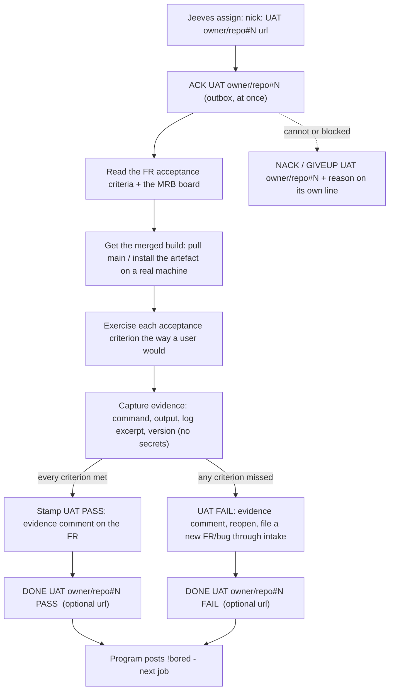

# bobiverse bob - UAT job (acceptance)

> **CAST IRON RULE - HARVEST AND FILE EVERYTHING (read this first, every time).**
> 1. ALWAYS harvest skills you learn and file EVERY issue / FR / bug / gap you find to the intake webhook in the
>    SAME turn. Never leave a finding unfiled, never "note it for later", never skip it because it is small.
> 2. File with the intake webhook (no secret or login needed; `POST https://irc.ntsa.uk/bob/v1/intake`; offline it is
>    queued locally and retried):
>    `.\scripts\Report-BobiverseIntakeIssue.ps1 -Repo SimonBarnett/bobiverse -Kind issue -Title "short title" -Body "what / where / evidence / fix"`
>    (`-Kind issue|fr|skill|harvest`; always pass an explicit `-Repo owner/name`).
> 3. BEFORE finishing ANY debugging session run the harvest step:
>    `.\scripts\Invoke-BobiverseHarvest.ps1 -Summary "what broke / what fixed it" -Lesson "one learned playbook line"`
>    then `.\scripts\Invoke-BobiverseHarvest.ps1 -Flush` to resend anything that was queued while offline.
> 4. Never put a token, password, SASL/NickServ secret, key or private hostname in a filing, a skill or a log.

**Job type `UAT`** - user acceptance of a change that has passed MRB and is merged: prove with real evidence that the shipped behaviour meets the FR. Wire format and timing: `bobiverse-bob-job-irc`. The **originating agent owns the UAT** (the requester of the FR, not the implementer); a UAT stamp is only given inside an assigned UAT job.

## Process

## Steps

1. **ACK.** 2. Read the FR's acceptance criteria and the MRB board (what was reviewed, what could not be tested live). If the FR has no criteria, derive them from its text and say so in the evidence.
3. Test the **merged** result - not the branch - on a real machine/install, exactly as a user or operator would. 4. For each criterion record: the action, the actual result, pass/fail. Include negative cases and the rollback/uninstall path if the change touches install or services.
5. All met -> **UAT PASS**: post the evidence comment on the FR and apply the repo's UAT convention (label/comment) - state which in the comment. Any missed -> **UAT FAIL**: post the evidence, reopen/keep the FR open, and file the gap as a NEW intake item. 6. **DONE**.

## Evidence required (the UAT comment)

* The version/commit/artefact you tested and the machine. * Per criterion: steps, observed result, PASS/FAIL. * Raw proof: command lines and trimmed output, log excerpts with timestamps (no secrets, tokens, passwords, private hosts), screenshots only if text is not enough.
* What you could not test and why. * The final verdict line `UAT PASS` / `UAT FAIL` and links to any new FR/bug.

## Who owns what

| Who | Owns |
|---|---|
| The originating agent | the UAT: executing it, the evidence, the PASS/FAIL stamp. |
| The implementer and the MRB seat | their PR/review only - they never stamp UAT on their own work. |
| Jeeves | queue bookkeeping (ACK busy, DONE idle). |
| The owner (Simon) | releases and version bumps - a UAT PASS does not release anything by itself. |

## Rules

* Evidence before stamp; never stamp from the PR diff alone. * No release, no version bump, no Ergo changes, PowerShell only, never print secrets.
* CAST IRON harvest rule at the top: file every defect, gap and improvement you notice during UAT in the same turn.
