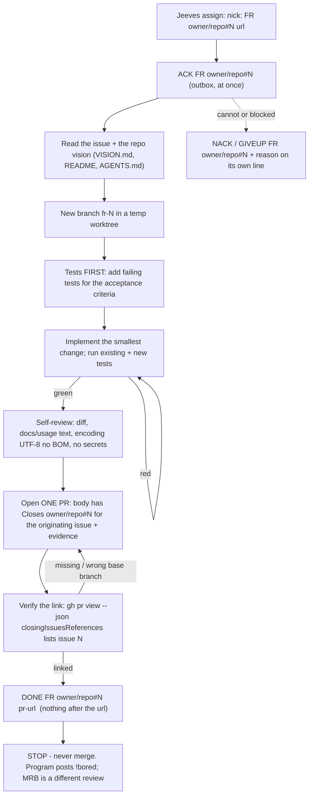

# bobiverse bob - FR job (implement)

> **CAST IRON RULE - HARVEST AND FILE EVERYTHING (read this first, every time).**
> 1. ALWAYS harvest skills you learn and file EVERY issue / FR / bug / gap you find to the intake webhook in the
>    SAME turn. Never leave a finding unfiled, never "note it for later", never skip it because it is small.
> 2. File with the intake webhook (no secret or login needed; `POST https://irc.ntsa.uk/bob/v1/intake`; offline it is
>    queued locally and retried):
>    `.\scripts\Report-BobiverseIntakeIssue.ps1 -Repo SimonBarnett/bobiverse -Kind issue -Title "short title" -Body "what / where / evidence / fix"`
>    (`-Kind issue|fr|skill|harvest`; always pass an explicit `-Repo owner/name`).
> 3. BEFORE finishing ANY debugging session run the harvest step:
>    `.\scripts\Invoke-BobiverseHarvest.ps1 -Summary "what broke / what fixed it" -Lesson "one learned playbook line"`
>    then `.\scripts\Invoke-BobiverseHarvest.ps1 -Flush` to resend anything that was queued while offline.
> 4. Never put a token, password, SASL/NickServ secret, key or private hostname in a filing, a skill or a log.

**Job type `FR`** - implement a feature request or fix a bug. Wire format, channel and timing: `bobiverse-bob-job-irc` (read it first). You implement and open ONE pull request; you never merge it.

## Process



## Steps

1. **ACK** the assign line (exact id). 2. Read the issue, linked FRs and the vision/README so you serve the intent, not just the letter. 3. Work in a temporary worktree/branch, never on `main`.
4. **Tests first**: new tests that fail for the right reason, then the implementation. 5. Run the whole suite (not just yours). 6. Update docs/usage/skills your change makes stale.
7. Open exactly **one** PR against the repo's default branch, title referencing the FR, body containing the line **`Closes <owner>/<repo>#N`** (the full form, the originating issue - not just `#N`, not only in a comment) plus the evidence block below. A PR that targets a non-default branch does not auto-close the issue: say so in the body so the MRB closes it by hand.
8. **Verify the link before DONE**: `gh pr view <pr> --repo <owner>/<repo> --json body,baseRefName,closingIssuesReferences` must list issue N in `closingIssuesReferences` (or, for a non-default base, the body must carry the `Closes` line and say it needs a manual close). Fix the body and re-check if not. 9. Send **DONE** (PR url last, nothing after it). 10. Stop.

## Duplicates: find and close them before DONE (t857u)

Harvest receipt rule: any receipt whose title or body says DONE, twin, duplicate, filed, or merged is closed by the worker/MRB as soon as it is filed; a receipt is never left open.

One issue per issue: when MRB (or any worker) finds a twin/duplicate issue, close the later one and comment a reference to the first; never leave both open; done issues are closed too.

An FR worker who finds the assigned issue is a duplicate/twin or already done must comment the reference to the first issue or covering PR and close the issue itself before sending DONE; never merely report it.

When your PR fixes something, **search the repo's open issues/FRs for duplicates of what the PR fixes** before you send DONE
(`gh issue list --repo <owner>/<repo> --state open --search "<keywords>" --json number,title,labels`; also the harvest/CRITICAL re-offer
records that describe the same defect). For every duplicate (never the originating issue itself, never `needs-human` / `board` issues):

* comment on it **`Duplicate of #N / fixed by PR #M`** (N = the originating issue, M = your PR) and close it as not planned:
  `gh issue close <dup> --repo <owner>/<repo> --reason "not planned" --comment "Duplicate of #N / fixed by PR #M"`;
* list every one in the PR body under **`Duplicates closed:`** (`- owner/repo#D duplicate of #N`). A *real* separate issue the PR also fixes gets its own
  full-form **`Closes <owner>/<repo>#D`** line in the body (so merging closes it); a pure duplicate is closed now with the comment above, not left for the merge.
* No duplicate found: write `Duplicates closed: none (searched: <keywords>)` in the PR body. The MRB checks this line.

## Install work tree / sparse exclude (FR #132)

Skill-intake consolidation: when a worker takes an FR from skill intake (label:skill / harvest), it must close all open issues for that skill book (every harvest/skill issue targeting the same book), open one consolidated PR for them, and cite every issue it closes (Closes #N for each); no per-issue PRs for the same skill book; the worker closes the issues itself as part of DONE.

Fleet installs (`C:\ai\bob`, etc.) are sparse git work trees. `.git/info/exclude` starts with `/*` so composed flat runtime files stay invisible. Linked `git worktree add` FR trees **share that exclude**.

* Prefer: `git -C <install> worktree add -b fr-N <temp> origin/main` then `git sparse-checkout disable` in the temp tree.
* New untracked files under paths still masked by exclude are skipped by plain `git add` - use **`git add -f`** (or `git check-ignore -v` to confirm).
* Bootstrap exclude un-ignores `/$Product/`, `/common/`, `/airc/`, `/jeeves/`; paths outside those still need `-f`.

* **FR #963 / pytest ``repo_layout``:** canonical helper is ``common/scripts/repo_layout.py``. Prefer ``git sparse-checkout disable`` in the temp tree. If you keep a partial sparse set, always include ``common/scripts`` (and root ``conftest.py`` / ``pytest.ini`` when running from repo root). Service ``*/tests/conftest.py`` also puts ``common/scripts`` on ``sys.path``, so ``python -m pytest jeeves/tests/...`` works without ``PYTHONPATH=common/tests``.

## Job worktree cleanup (FR #877)

* **StrictMode `.Count`:** wrap `Sort-Object`/`Where-Object` results with `@()` before `.Count` (FR #1664 / Clear-BobiverseJobWorktrees). FreeGB capacity shortfalls are separate FRs - do not close them as duplicates of the StrictMode fix (harvest #1689).
Leftover `%TEMP%\bobiverse-*` / `fr-*` / `mrb-*` linked worktrees fill `C:` until `git worktree add` fails with **No space left on device**.

* **Before** creating a new job tree, and **after DONE** (once the PR is up): run
  `..\scripts\Clear-BobiverseJobWorktrees.ps1 -RepoRoot <ai root>\bob -KeepPath <current-job-wt>`
  (or `-Force` for full reclaim even when FreeGB ≥ 2).
* Default gates (FR #877 / **FR #1661**):
  * **Low disk:** prune when **FreeGB < 2** (`-MinFreeGB 2`) - removes all job trees + orphan `%TEMP%\bobiverse-*`.
  * **Earlier prune / soft cap:** even when FreeGB ≥ MinFreeGB, remove extras beyond `-MaxExtraJobTrees` (default **0** = keep only `-KeepPath` + install root). Do not wait until FreeGB is critical.
* Manual one-liner if the script is missing: `git -C <install> worktree remove --force <old-wt>; git -C <install> worktree prune`.
* Never delete the install root (`C:\ai\bob`) or Ergo.

## DONE URL - capture `gh pr create` output (FR #108)

Never guess the next pull number and never draft `DONE ... pull/N` before `gh pr create` returns.

```powershell
$url = (gh pr create --repo owner/name --base main --head fr-N --title '...' --body-file $pr 2>&1 |
  Select-String -Pattern 'https://github.com/\S+/pull/\d+').Matches.Value |
  Select-Object -First 1
if (-not $url) { throw 'gh pr create did not print a pull URL' }
Add-Content -LiteralPath $outbox -Value "PRIVMSG #shop :DONE FR owner/repo#N $url" -Encoding utf8
```

On Windows PowerShell 5.1, keep the PR body in `--body-file` (multiline `--body` argv splits). If a bad DONE already went out, append a corrected `DONE` line with the real URL immediately.

**FR #791 / gh issue close:** `gh issue close N --body-file` is an **unknown flag** on current `gh` - it does not accept `--body-file`. Close with a comment via `-c` / `--comment` only, e.g. `gh issue close <dup> --repo <owner>/<repo> --reason "not planned" --comment "Duplicate of #N / fixed by PR #M"`. Use `--body-file` for `gh pr create` / `gh pr edit` / `gh issue create`, never for `gh issue close`.

## Evidence required (in the PR body)

* The line `Closes <owner>/<repo>#N` for the originating issue. * What changed and why (one paragraph) and the files touched. * The new tests (names) and the full-suite result (`N passed`). * How you verified it for real (command + short output) and **what you could not test live**.
* Assumptions and risks. * Links: the FR, related issues. No secrets, tokens, private hosts or credential files in the body, the diff or the logs.

## Who owns what

| Who | Owns |
|---|---|
| You (implementer) | the PR, its tests and its evidence. You open it and stop - **no merge, no self-approve, no closing the FR after your own push**. |
| The originating agent (whoever raised/requested the FR) | the hostile MRB (`bobiverse-bob-job-mrb`, done by a different seat/session than yours) and the UAT (`bobiverse-bob-job-uat`). |
| Jeeves | the queue: assigns in `!focus` order, marks ACK busy and DONE idle. |
| The program | `!bored`, `pong`, restarts. |

## Rules
* **Never `Closes` a `label:skill` / `harvest:` intake from an unrelated product/docs/vendor PR** (harvest #1674 / MRB #1660). Use `Refs SimonBarnett/bobiverse#N` only. Close the harvest record separately when lessons are already on main (`Duplicate of #N / fixed by PR #M` / harvest-complete), or via a dedicated skill-promote PR that actually absorbs that receipt.
* Before merge/MRB: `python common/scripts/check_conflict_markers.py` must be clean (FR #1634); merge `origin/main` into behind branches first.

* **Never stamp `needs-mrb1`/`mrb1` (harvest #1717 / FR #1526):** CAST IRON. Do not open that label, do not apply it, do not wait on it. `needs-human` is the only human gate. Operator deleted the label; leftover references in old docs are stale.
* **Every FR PR body contains `Closes <owner>/<repo>#N`** and you verified it (step 8) before DONE. * One FR = one PR. A fix that needs more work goes to a new FR through intake, not into this PR. * Never touch Ergo config, never restart `BobIrcd`, never disturb other seats, PowerShell only.
* Do not rebuild/release/bump the version unless the FR says so. * CAST IRON harvest rule at the top: file every issue, FR, bug and learned playbook in the same turn.

## Machine pin / ionos-only FRs (FR #587 / #852 / #1550)

Chair stamps `require_machine` from labels (`needs-ionos`, `machine:ionos`) and title/body cues. After FR #852 / #1550 / #1559 (PR #1574), cues include:

* **recycle/recompose (irc)Jeeves** and **prune queue.json**
* Title: **ircJeeves↔StartPending**, **idle seats↔ungated offerable**
* Body (ops context only): `Invoke-JeevesMonitorCheck` near idle_seats/StartPending/offerable/no shop OFFER

Chair lives on ionos (folds to win-mpre*). Non-matching seats must **GIVEUP** (or never receive the offer once the live chair has the gates).

* Marchhare / flamingo / other non-ionos seats cannot bounce ionos `ircJeeves`, edit ionos `queue.json`, or diagnose StartPending/idle+ungated on the chair host — those FRs are ionos-only.
* **Honor `require_machine=<mid>` literally** (harvest #1688): if the assign body, title, labels, or queue stamp pins a machine you are not on, **ACK then GIVEUP** with `require_machine=<mid>` (or `needs-ionos`) in the reason line. Do not attempt the work.
* If the chair **offered a pinned FR to a non-matching seat** (stamp present, wrong shop): GIVEUP as above **and file intake** for the offer gap (class of #1687). File intake also when the stamp was missing but cues clearly demand ionos.
* Skill-promote jobs (FR #1682 / #1684) are **not** a reason to ignore a real `require_machine` pin — if the skill/harvest issue itself is pinned ionos and you are not on ionos, still GIVEUP.
* **Skill-promote / harvest-backlog assigns (FR #1682 / FR #1684)** - chair **offers** `label:skill` / `harvest:` / `skill:` intakes as FR promote jobs (not product code FRs). Do **not** GIVEUP. Consolidate open skill receipts **by owner skill book**, close duplicate skill-book requests, open **one** `harvest/…` promote PR (`Closes` / `Duplicates closed:`), then DONE with the PR URL for hostile MRB. Full steps: `harvest-agent-skills` -> **Worker: consolidate open skill receipts -> promote PR**. Never one PR per receipt; never merge yourself. Skill/harvest still do **not** block repo UAT.

## Twin / already-fixed FRs (FR #751 / #905 harvest)

Older open FRs that **restate a defect already fixed** on main (e.g. closed-PR-as-FR twins of #838/#846 after #854+#867 merged) must **not** be re-implemented:

1. ACK.
2. Find the merged fix PR (`gh pr list --state merged --search "…"`, or the FR body / related issues).
3. Confirm the fix is on `main` and covers this issue’s acceptance.
4. **DONE** with that **existing merged PR URL** (or the open PR that already `Closes` this issue). Comment on the issue: no duplicate.
5. If GitHub did not auto-close this twin, close it with a comment pointing at the fix PR (`Duplicate of #N / fixed by PR #M` when it is a pure duplicate).

Never open a second PR that re-lands the same gates.

## DONE FR must not re-offer while implement PR is open (FR #2617 / MRB #2621)

After `DONE FR owner/repo#N https://github.com/…/pull/M`, chair `resync_from_github` must **keep** that DONE row in `done[]` while pull `M` is still open (or the PR repo was not fetched). Stripping premature-DONE for still-open issues (FR #1150) without this keep broke `fr_superseded_by_done_pr` and re-offered the FR to a sibling seat (~1 min after DONE; live #2612 / #2615). When the Closes PR is gone unmerged, FR #2389 still re-queues the open issue as FR.
