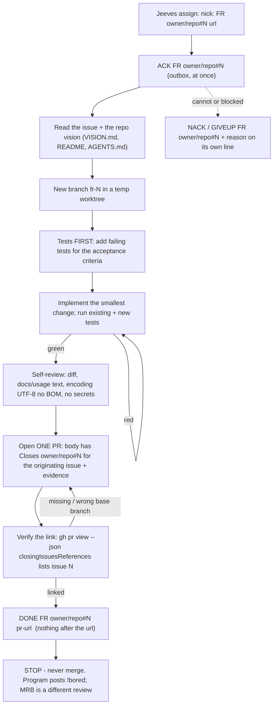

# bobiverse bob - FR job (implement)

> **CAST IRON RULE - HARVEST AND FILE EVERYTHING (read this first, every time).**
> 1. ALWAYS harvest skills you learn and file EVERY issue / FR / bug / gap you find to the intake webhook in the
>    SAME turn. Never leave a finding unfiled, never "note it for later", never skip it because it is small.
> 2. File with the intake webhook (no secret or login needed; `POST https://irc.ntsa.uk/bob/v1/intake`; offline it is
>    queued locally and retried):
>    `.\scripts\Report-BobiverseIntakeIssue.ps1 -Repo SimonBarnett/bobiverse -Kind issue -Title "short title" -Body "what / where / evidence / fix"`
>    (`-Kind issue|fr|skill|harvest`; always pass an explicit `-Repo owner/name`).
> 3. BEFORE finishing ANY debugging session run the harvest step:
>    `.\scripts\Invoke-BobiverseHarvest.ps1 -Summary "what broke / what fixed it" -Lesson "one learned playbook line"`
>    then `.\scripts\Invoke-BobiverseHarvest.ps1 -Flush` to resend anything that was queued while offline.
> 4. Never put a token, password, SASL/NickServ secret, key or private hostname in a filing, a skill or a log.

**Job type `FR`** - implement a feature request or fix a bug. Wire format, channel and timing: `bobiverse-bob-job-irc` (read it first). You implement and open ONE pull request; you never merge it.

## Process



## Steps

1. **ACK** the assign line (exact id). 2. Read the issue, linked FRs and the vision/README so you serve the intent, not just the letter. 3. Work in a temporary worktree/branch, never on `main`.
4. **Tests first**: new tests that fail for the right reason, then the implementation. 5. Run the whole suite (not just yours). 6. Update docs/usage/skills your change makes stale.
7. Open exactly **one** PR against the repo's default branch, title referencing the FR, body containing the line **`Closes <owner>/<repo>#N`** (the full form, the originating issue - not just `#N`, not only in a comment) plus the evidence block below. A PR that targets a non-default branch does not auto-close the issue: say so in the body so the MRB closes it by hand.
8. **Verify the link before DONE**: `gh pr view <pr> --repo <owner>/<repo> --json body,baseRefName,closingIssuesReferences` must list issue N in `closingIssuesReferences` (or, for a non-default base, the body must carry the `Closes` line and say it needs a manual close). Fix the body and re-check if not. 9. Send **DONE** (PR url last, nothing after it). 10. Stop.

## Duplicates: find and close them before DONE (t857u)

When your PR fixes something, **search the repo's open issues/FRs for duplicates of what the PR fixes** before you send DONE
(`gh issue list --repo <owner>/<repo> --state open --search "<keywords>" --json number,title,labels`; also the harvest/CRITICAL re-offer
records that describe the same defect). For every duplicate (never the originating issue itself, never `needs-human` / `board` issues):

* comment on it **`Duplicate of #N / fixed by PR #M`** (N = the originating issue, M = your PR) and close it as not planned:
  `gh issue close <dup> --repo <owner>/<repo> --reason "not planned" --comment "Duplicate of #N / fixed by PR #M"`;
* list every one in the PR body under **`Duplicates closed:`** (`- owner/repo#D duplicate of #N`). A *real* separate issue the PR also fixes gets its own
  full-form **`Closes <owner>/<repo>#D`** line in the body (so merging closes it); a pure duplicate is closed now with the comment above, not left for the merge.
* No duplicate found: write `Duplicates closed: none (searched: <keywords>)` in the PR body. The MRB checks this line.

## Install work tree / sparse exclude (FR #132)

Fleet installs (`C:\ai\bob`, etc.) are sparse git work trees. `.git/info/exclude` starts with `/*` so composed flat runtime files stay invisible. Linked `git worktree add` FR trees **share that exclude**.

* Prefer: `git -C <install> worktree add -b fr-N <temp> origin/main` then `git sparse-checkout disable` in the temp tree.
* New untracked files under paths still masked by exclude are skipped by plain `git add` — use **`git add -f`** (or `git check-ignore -v` to confirm).
* Bootstrap exclude un-ignores `/$Product/`, `/common/`, `/airc/`, `/jeeves/`; paths outside those still need `-f`.

## DONE URL — capture `gh pr create` output (FR #108)

Never guess the next pull number and never draft `DONE ... pull/N` before `gh pr create` returns.

```powershell
$url = (gh pr create --repo owner/name --base main --head fr-N --title '...' --body-file $pr 2>&1 |
  Select-String -Pattern 'https://github.com/\S+/pull/\d+').Matches.Value |
  Select-Object -First 1
if (-not $url) { throw 'gh pr create did not print a pull URL' }
Add-Content -LiteralPath $outbox -Value "PRIVMSG #shop :DONE FR owner/repo#N $url" -Encoding utf8
```

On Windows PowerShell 5.1, keep the PR body in `--body-file` (multiline `--body` argv splits). If a bad DONE already went out, append a corrected `DONE` line with the real URL immediately.

## Evidence required (in the PR body)

* The line `Closes <owner>/<repo>#N` for the originating issue. * What changed and why (one paragraph) and the files touched. * The new tests (names) and the full-suite result (`N passed`). * How you verified it for real (command + short output) and **what you could not test live**.
* Assumptions and risks. * Links: the FR, related issues. No secrets, tokens, private hosts or credential files in the body, the diff or the logs.

## Who owns what

| Who | Owns |
|---|---|
| You (implementer) | the PR, its tests and its evidence. You open it and stop - **no merge, no self-approve, no closing the FR after your own push**. |
| The originating agent (whoever raised/requested the FR) | the hostile MRB (`bobiverse-bob-job-mrb`, done by a different seat/session than yours) and the UAT (`bobiverse-bob-job-uat`). |
| Jeeves | the queue: assigns in `!focus` order, marks ACK busy and DONE idle. |
| The program | `!bored`, `pong`, restarts. |

## Rules

* **Every FR PR body contains `Closes <owner>/<repo>#N`** and you verified it (step 8) before DONE. * One FR = one PR. A fix that needs more work goes to a new FR through intake, not into this PR. * Never touch Ergo config, never restart `BobIrcd`, never disturb other seats, PowerShell only.
* Do not rebuild/release/bump the version unless the FR says so. * CAST IRON harvest rule at the top: file every issue, FR, bug and learned playbook in the same turn.
