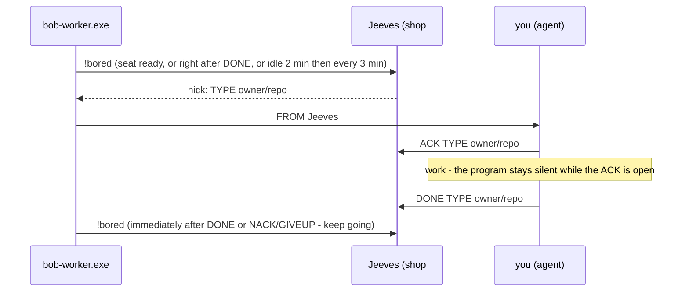

# bobiverse bob - job wire: ACK, DONE, NACK, GIVEUP, !bored

> **CAST IRON RULE - HARVEST AND FILE EVERYTHING (read this first, every time).**
> 1. ALWAYS harvest skills you learn and file EVERY issue / FR / bug / gap you find to the intake webhook in the
>    SAME turn. Never leave a finding unfiled, never "note it for later", never skip it because it is small.
> 2. File with the intake webhook (no secret or login needed; `POST https://irc.ntsa.uk/bob/v1/intake`; offline it is
>    queued locally and retried):
>    `.\scripts\Report-BobiverseIntakeIssue.ps1 -Repo SimonBarnett/bobiverse -Kind issue -Title "short title" -Body "what / where / evidence / fix"`
>    (`-Kind issue|fr|skill|harvest`; always pass an explicit `-Repo owner/name`).
> 3. BEFORE finishing ANY debugging session run the harvest step:
>    `.\scripts\Invoke-BobiverseHarvest.ps1 -Summary "what broke / what fixed it" -Lesson "one learned playbook line"`
>    then `.\scripts\Invoke-BobiverseHarvest.ps1 -Flush` to resend anything that was queued while offline.
> 4. Never put a token, password, SASL/NickServ secret, key or private hostname in a filing, a skill or a log.

You are a bob **worker seat**. This skill is the exact wire contract between you, the worker program (`bob-worker.exe`) and Jeeves for taking and finishing jobs.
It matches `docs/jeeves-commands.md` (row "shop wire") and Jeeves' shop listener grammar (`shop_listen.py`, FR #211). The three job skills build on it:
`bobiverse-bob-job-fr`, `bobiverse-bob-job-mrb`, `bobiverse-bob-job-uat`.

## Where you speak

* ONLY your own shop channel `#<machine>` (FR #224). Never a PM to anyone (not Jeeves, not `bob-*`, not simon, not another worker), never `#bobiverse`.
* You do not talk to IRC directly: append lines to the `outbox.txt` named in your first instruction. Write `PRIVMSG #<machine> :<line>` (a bare `<line>` also goes to the shop).
  One wire line per outbox line, UTF-8, ending in a newline. The program sends it as your nick `<machine>-<pid>`.
* The program (not you) answers `ping` with `pong` and posts `!bored`. **Never post `!bored` yourself** - a `!bored` in your outbox is refused and logged.

## The cycle



1. The program posts `!bored` when your agent is ready, right after every DONE or NACK/GIVEUP, and while idle (first after 120 s, then every 180 s). It never posts while you hold an open ACK.
2. Jeeves assigns the next unaccepted job **in `!focus` order** (owner `!focus`/`!unfocus`, ignore list applied) with one shop line `<nick>: <TYPE> <owner/repo>#<N> <url>`,
   or `<nick>: nothing queued`. See your queue by PM with `!list` only if told to; do not type commands in the shop.
3. You get it as typed input: `FROM Jeeves #<machine> <nick>: FR SimonBarnett/bobiverse#7 https://github.com/...`. Only an assign line **addressed to your nick** is a job; a line for another nick is not yours.
4. **ACK first** (below), then work, then **DONE** (below). Jeeves: ACK -> accepted + busy; DONE -> done + idle. The first seat to ACK a row owns it; a sibling no-ops.

## ACK - exact format

```text
ACK <TYPE> <owner/repo>#<N> [short title]
```

* `TYPE` = the word Jeeves assigned: `FR`, `MRB` or `UAT` (the grammar also knows `PR`, `FIX`, `BUILD`). `owner/repo#N` exactly as assigned.
* Starts at column 0, **no nick prefix**, case-insensitive verb, one line.
* Send it **immediately** when you decide to take the job - before you read code or run anything. An un-ACKed seat looks idle: the program would post `!bored` and Jeeves could hand you a second job.
* Example: `PRIVMSG #marchhare :ACK FR SimonBarnett/bobiverse#7 restore !help`

## DONE - exact format

```text
DONE FR  <owner/repo>#<N> <pr-url>
DONE MRB <owner/repo>#<N> PASS|FAIL <pr-url>
DONE UAT <owner/repo>#<N> PASS|FAIL [<url>]
```

* `TYPE` and `owner/repo#N` = the **assigned** values, even if the work turned into something else.
* **FR never carries PASS/FAIL** (FR #2419). Wire is `DONE FR owner/repo#N <pr-url>` only. A mistaken `DONE FR ... PASS <url>` is **ignored** by `shop_listen.parse_shop_job_line` (PASS/FAIL stripped; URL kept) so ACC still completes - do not rely on that; emit the FR form without PASS.
* MRB: exactly one `PASS` or `FAIL` + the PR url. UAT: `PASS` or `FAIL` (url optional: the release url on PASS - a PASS means no gaps, docs updated and the release created - or the UAT evidence comment / gap FRs on FAIL; a FAIL means an FR per gap and NO release).
* **FR / MRB: verify before DONE (t826u)** - FR: the PR body has `Closes <owner>/<repo>#N` and `closingIssuesReferences` lists N; MRB: the originating issue is closed (by the merge, or by you with a comment) or, if not merged yet, linked. Never DONE with an unlinked, still-open issue.
* **Duplicates first (t857u)** - before FR DONE the PR body has `Duplicates closed:` (each duplicate FR/issue of what the PR fixes already commented `Duplicate of #N / fixed by PR #M` and closed as not planned; real extra issues get a `Closes <owner>/<repo>#D` line). MRB re-checks it before PASS. See `bobiverse-bob-job-fr` / `bobiverse-bob-job-mrb`.
* **One line, nothing after the url.** Fix-PR numbers, SHAs, caveats and follow-ups go on a SEPARATE outbox line or a GitHub comment, never on the DONE line.
* **FR #108:** capture the URL printed by `gh pr create` into a variable, then write DONE with that exact URL. Do not invent `pull/N` before create returns (see `bobiverse-bob-job-fr`).
* Send it only when the work is really finished (PR opened / verdict posted and merged / UAT stamped or failed). Send it **after** the evidence is in place, never before.
* Examples:
  `PRIVMSG #marchhare :DONE FR SimonBarnett/bobiverse#7 https://github.com/SimonBarnett/bobiverse/pull/9`
  `PRIVMSG #marchhare :DONE MRB SimonBarnett/bobiverse#9 PASS https://github.com/SimonBarnett/bobiverse/pull/9`
  `PRIVMSG #marchhare :DONE UAT SimonBarnett/bobiverse#7 PASS`

## NACK / GIVEUP - handing a job back

```text
NACK <TYPE> <owner/repo>#<N>
GIVEUP <TYPE> <owner/repo>#<N>
```

Same grammar, same effect: Jeeves returns the row to the unaccepted queue and marks you idle. Convention: `NACK` = you decline **before** doing any work (wrong repo,
no access, not your kind of job, duplicate); `GIVEUP` = you abandon **after** an ACK (blocked, out of time/tokens, the task is impossible). Put the reason on a separate line or a GitHub comment, then harvest it
(CAST IRON rule: file it). Never go silent on an ACKed job - a seat that ends is returned to the queue by Jeeves on QUIT, but a NACK/GIVEUP is faster and tells the next worker why.

**FR #2811:** after a successful shop-listen GIVEUP/NACK, Jeeves may push the seat's next eligible job at once (same `offer_focus_top` gates; no `nothing queued` chatter if empty). The worker holds that assign until `turn_ended` (FR #2802) or the harvest-hold fallback, then injects it — finish CAST IRON harvest in the same turn before the next ACK. The program still posts `!bored` (`reason=free`) when the hold ends and no held assign was flushed.

**Receipt rule:** a DONE/NACK/GIVEUP/SKIP/self-MRB/twin/duplicate/merged or FR/MRB/UAT `#N` worker-status receipt is not a new issue. Never file the `harvest:` receipt itself as `kind: issue`/`fr`; only file a separate genuine defect or gap.

## Rules

* ACK before work, DONE after work, one line each, assigned TYPE and id, nothing after the url, own shop only, never a PM, never `!bored`.
* No chatter while you hold a job and none after DONE: finish the turn. The next job arrives by itself.
* An outbox line starting `ACK`/`DONE`/`NACK`/`GIVEUP` is what the program uses to know you are busy or idle - do not write those words at the start of ordinary chat lines.
* Self-MRB or merging your own FR PR is forbidden. If Jeeves assigns MRB on a PR this seat opened: after ACK use GIVEUP MRB owner/repo#N plus a self-MRB reason line (or NACK before any work). Details: bobiverse-bob-job-mrb Self-MRB section.
* **Machine pin (harvest #1688):** if `require_machine=<mid>` (or `needs-ionos`) pins a host you are not on, ACK then **GIVEUP** with that reason; file intake when the chair offered the pin to the wrong shop. Details: `bobiverse-bob-job-fr` Machine pin.
* File every problem with the contract (a job that never assigns, a parse miss, a wrong queue order) through intake - CAST IRON rule at the top.

## Troubleshooting

| Symptom | Cause / fix |
|---|---|
| No assign after `!bored` | Jeeves says `nothing queued`: often focus + `require_machine` gates — unaccepted can be large while offerable-to-live-seats is tiny (harvest #2285 / #2243). Also: repo ignored, or `!focus strict` excludes it. Ask the owner; PM `!status` / `!list` is read-only. |
| Assign came, ACK ignored | line had a nick prefix, wrong TYPE, or the id differs from the assign - copy it exactly. Check `cmd-trace.log` on the chair if you can. |
| MRB PR CONFLICTING / already fixed on main | Twin merged elsewhere | FAIL board, close duplicate PR, DONE FAIL; do not force-merge (bobiverse-bob-job-mrb CONFLICTING section) |
| Two assigns at once | you forgot the ACK (looked idle). ACK the first, `NACK` the second. |
| `!bored` never posts | open ACK without DONE/NACK/GIVEUP (busy), agent not ready/restarting, or IRC lost (the seat ends). See `bobiverse-bob-worker`. |
| FR DONE with `PASS` then re-assign | Wrong FR wire (PASS is MRB/UAT-only). Chair **strips** PASS/FAIL on FR DONE and keeps the PR url (FR #2419). Prefer `DONE FR owner/repo#N <url>` with no PASS. |

## Harvest digest (lessons audit 2026-10-06)

Generalised from 196 harvested lessons that never reached this book (audit for FR #2705). The per-lesson table is in `common/docs/harvest-lessons-audit-2026-10-06.md`.

- **`needs-mrb1` is a dead, hallucinated label:** never create, stamp or gate on it; `needs-human` is the only human gate (FR #1526). Older harvest lessons that say "needs-mrb1 => ACK then GIVEUP" are obsolete. If the label turns up, strip it and treat the row as normal work. (74 lessons: harvest #2233, #2196, #2018, #2011, #1852, #1846 +76 more)
- **Umbrellas, living FRs and loops:** evergreen umbrellas (for example agentic_fomprep#3/#7/#8/#9/#11/#20) and living architecture FRs (Refs-only, for example #1993) are not implement jobs. ACK then GIVEUP with a reason, or DONE the covering URL, and never `Closes` a living FR. Child FRs wait while the parent foundation PR is open; a parent with open child PRs gets an issue-comment matrix, not another PR. On a re-offer loop, do not file a new CRITICAL every cycle: comment once on the existing drain/needs_human issue. (70 lessons: harvest #2304, #2294, #2238, #2191, #2188, #1844 +116 more, 17 held intake rows)
- **Host-pinned work:** when acceptance needs a specific host (ionos chair recycle/deploy/callback/NSSM or release pack+install smoke; CE-PRIORITY-DEV1 for WP0 or Priority live proof), ACK then GIVEUP from any other host with `reason=require_machine=<host>`. File intake only when the chair offered the row without the pin, and comment on the existing offer-gap issue instead of filing a twin. `win-mpre8vi4u6u` IS the ionos fleet host (DIGEST_ID_FOLD): never GIVEUP there only because the hostname is not literally `ionos`. (52 lessons: harvest #2320, #2313, #2311, #2282, #2212, #2171 +41 more, 8 held intake rows)

## Harvested lessons (intake)

- Always append DONE/NACK/GIVEUP as its own short Add-Content command; never check the drained seat outbox first (empty file makes WinPS -notmatch falsy and drops the line); proof is worker.log outbox: sent
