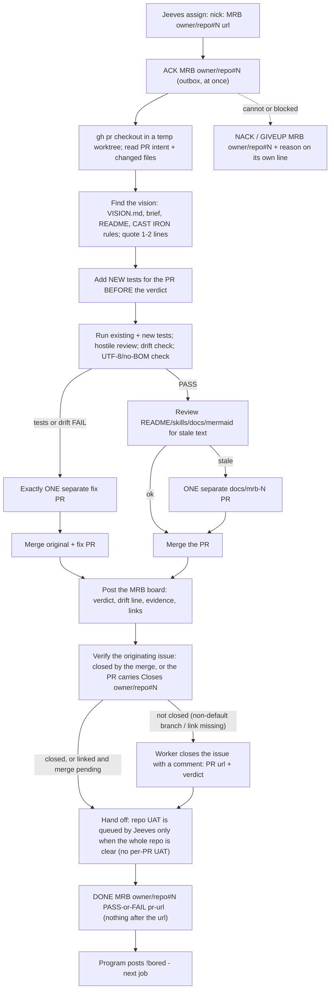

# bobiverse bob - MRB job (hostile review)

> **CAST IRON RULE - HARVEST AND FILE EVERYTHING (read this first, every time).**
> 1. ALWAYS harvest skills you learn and file EVERY issue / FR / bug / gap you find to the intake webhook in the
>    SAME turn. Never leave a finding unfiled, never "note it for later", never skip it because it is small.
> 2. File with the intake webhook (no secret or login needed; `POST https://irc.ntsa.uk/bob/v1/intake`; offline it is
>    queued locally and retried):
>    `.\scripts\Report-BobiverseIntakeIssue.ps1 -Repo SimonBarnett/bobiverse -Kind issue -Title "short title" -Body "what / where / evidence / fix"`
>    (`-Kind issue|fr|skill|harvest`; always pass an explicit `-Repo owner/name`).
> 3. BEFORE finishing ANY debugging session run the harvest step:
>    `.\scripts\Invoke-BobiverseHarvest.ps1 -Summary "what broke / what fixed it" -Lesson "one learned playbook line"`
>    then `.\scripts\Invoke-BobiverseHarvest.ps1 -Flush` to resend anything that was queued while offline.
> 4. Never put a token, password, SASL/NickServ secret, key or private hostname in a filing, a skill or a log.

**Job type `MRB`** (Material Review Board) - hostile, tests-first review of a pull request against the FR and the repo vision. Wire format and timing: `bobiverse-bob-job-irc`. The MRB is done by a **different seat or a fresh session** than the one that wrote the PR; the originating agent owns the review. An assigned MRB job authorises you to merge **that PR** (and its one docs/fix PR) - nothing else.

## Process

## Steps

1. **ACK.** 2. Check out the PR in a temp worktree; read the intent, the FR and every changed file. Before `git worktree add`, if `Get-PSDrive C` FreeGB is under 2, run `..\scripts\Clear-BobiverseJobWorktrees.ps1 -RepoRoot <ai root>\bob` (FR #877). **CAST IRON (FR #2727):** never hand-delete / `Remove-Item` paths Clear did not select; if FreeGB stays under 2 after Clear, file an intake disk issue and put the MRB tree on a roomy drive (or GIVEUP) — do not invent a `C:\ai\*` delete list. After DONE, prune again with `-KeepPath` omitted so the MRB tree can go. 3. **Vision first**: read `VISION.md`/brief/README/AGENTS and quote 1-2 lines the PR is judged against. For **bob** ear/worker/tray changes prefer **`bob/VISION.md`** (FR #1615 / harvest #1632); the fleet umbrella stays `common/docs/vision.md` — do not treat the umbrella as the bob product vision.
No vision found: record "no vision source found", review against README + FR, and file ONE FR asking for a `VISION.md`. If the PR shows the vision itself should change, do not edit it - file an FR tagged `vision` for the owner.
4. **Tests before verdict**: add the new tests the PR needs, then run existing + new. **FR #2655 (airc PRs):** before PASS, run the full `airc/tests` suite (not only the new FR file) — signature changes like `send_privmsg(..., flood=)` break 2-arg monkeypatch stubs elsewhere. 5. Hostile review + **drift check** (separate verdict line): serves the stated vision? contradicts CAST IRON / earlier decisions? scope creep? under-delivery (letter, not intent; code never wired)? Drift is a FAIL like a red test. **ACCEPTABLE drift (harvest #1663):** a partial FR that lands the core acceptance and files explicit follow-up issues for the remainder (e.g. SkipTidy autostart PASS while TipForm Restart still tidies; leftover #1642/#1643) may PASS — say so on the drift line; do not FAIL solely for intentional scoped follow-ups.
6. Encoding: changed *.md are UTF-8 without BOM (no mojibake). **CAST IRON (FR #1634):** before every gh pr merge, run python common/scripts/check_conflict_markers.py --root <worktree> (or rely on the check-conflict-markers CI workflow) and **refuse merge** if any <<<<<<< / ======= / >>>>>>> conflict markers remain in the tip. **Behind-main (harvest #1647 / #1657):** if the PR head is behind origin/main, merge (or rebase) origin/main into the FR branch and re-run conflict-marker + tests **before** gh pr merge. 7. **PASS** -> review docs/skills/usage text for staleness; if stale open exactly ONE **separate** docs/mrb-<N>-... PR (never push onto the PR under review) and merge both; if not, merge the PR. Additive hostile tests that are not product fixes belong on that docs/mrb-N PR. **Body/docs-only nits** (e.g. missing Duplicates closed: line) while tests are green: PASS and merge without a separate **fix** PR — put wording nits on the docs PR or edit the PR body; close harvest twins as not planned (Duplicate of #N / fixed by PR #M).
**Harvest promote order (harvest #2296 / MRB #2289):** merge the **skill/promote PR first**, then open the one `docs/mrb-N` hostile-test PR **from the new `origin/main` tip** (not from the pre-merge promote tip). Before **DONE PASS**, verify `gh issue view` that `Closes` actually closed the skill issue (or close it with a comment). Example: #2289 then docs #2295.
**FAIL** -> exactly ONE separate fix PR, then merge original + fix (not several fix PRs). Never merge UNSTABLE/red. 8. Post the MRB board. **Issue closure (t826u):** the assigned MRB authorises you to merge that PR (and its one docs/fix PR). On merge, the PR's **`Closes <owner>/<repo>#N`** line closes the originating issue - confirm that line is in the PR body (add it by editing the body if the FR author missed it; a fix/docs PR gets `Refs`, never a second `Closes`). If you are **not authorised to merge**, still confirm the `Closes` link so the issue closes when the owner merges, and say so on the board.
After the merge check `gh issue view N --repo <owner>/<repo> --json state`: if it is still open (PR merged into a non-default branch, or the link was missing) **close it yourself with a comment** (`gh issue close N --comment "Closed by <PR url> (merged into <branch>). MRB: <verdict>"`). **FR #791:** `gh issue close` does not accept `--body-file` (unknown flag) — use `-c` / `--comment` only. A FAIL that ends without a merge leaves the issue open.
9. Hand off: there is no per-PR UAT - Jeeves queues ONE repo-level UAT once every issue is closed and every PR is merged. 10. **DONE (own command)** - only after the issue is verified closed, or (not merged yet) verified linked via `closingIssuesReferences`. Order after the board/merge: append DONE/NACK/GIVEUP as its own short command (never check the outbox first; FR #2876), **then** harvest/prune — never chain DONE inside a long board/merge/harvest tool call.

## Duplicates: verify and close them (t857u)

Harvest receipt rule: any receipt whose title or body says DONE, twin, duplicate, filed, or merged is closed by the worker/MRB as soon as it is filed; a receipt is never left open.

One issue per issue: when MRB (or any worker) finds a twin/duplicate issue, close the later one and comment a reference to the first; never leave both open; done issues are closed too.

The PR body must carry a **`Duplicates closed:`** line (or `none (searched: ...)`). During the review search the open issues again for duplicates of what the PR fixes;
any still open that the implementer missed: comment **`Duplicate of #N / fixed by PR #M`** and close as not planned
(`gh issue close <dup> --repo <owner>/<repo> --reason "not planned" --comment "Duplicate of #N / fixed by PR #M"`), and add it to the board. A real extra issue the PR
fixes needs its own full-form `Closes <owner>/<repo>#D` line. A PR with no `Duplicates closed:` line is a review nit; a PR that leaves an obvious open duplicate is a FAIL
once the implementer cannot be reached. Never close `needs-human` / `board` issues as duplicates.

## Pytest / sparse worktrees (FR #963)

Skill-intake consolidation: when a worker takes an FR from skill intake (label:skill / harvest), it must close all open issues for that skill book (every harvest/skill issue targeting the same book), open one consolidated PR for them, and cite every issue it closes (Closes #N for each); no per-issue PRs for the same skill book; the worker closes the issues itself as part of DONE.

`repo_layout` lives in `common/scripts/repo_layout.py`. Prefer `git sparse-checkout disable` in the MRB temp tree. Partial sparse sets must include `common/scripts`; do not rely on `PYTHONPATH=common/tests`. Service `*/tests/conftest.py` puts `common/scripts` on `sys.path`.

**bob_worker tip shadow (FR #2782 / MRB #2789):** when pytest-importing `bob_worker` from a job worktree, run pytest with cwd set to that worktree and put `<wt>\bob\scripts` first on `PYTHONPATH`. The install flat copy `<ai root>\bob\worker\bob_worker.py` otherwise shadows the tip module and makes tip tests look like main failures. Seat cwd alone is not enough if the flat install copy is found first.

## Evidence required (the MRB board comment on the PR/issue)

* **Verdict** `PASS`/`FAIL`, plus the **drift verdict** line and the quoted vision line(s). * Tests: which new tests you added, the exact commands run, pass/fail counts, any flaky/skipped.
* Hostile findings (numbered, with file:line) and how each was resolved (or why it is acceptable). * Docs verdict (stale or not; link to the docs PR if any). * Merge result (SHAs/PR links), and **what could not be tested live**. * No secrets or private hosts.

## Who owns what

| Who | Owns |
|---|---|
| The originating agent | the hostile MRB and its verdict, the merge decision, then the UAT hand-off (`bobiverse-bob-job-uat`). |
| The implementer | the PR under review - they never review or merge their own PR; findings go back as the one fix PR (written by the MRB seat). |
| Jeeves | queue and busy/idle bookkeeping; announces merges. |
| The owner (Simon) | the vision; releases and version bumps (not part of an MRB). |

## Rules

* **A successful MRB closes the originating issue**: merge -> `Closes` auto-closes it; otherwise you close it with a comment (never leave a merged PR's issue open, never close it for a FAIL that did not merge). * Different seat/session than the author. One docs PR at most; one fix PR at most. No release, no version bump, no Ergo changes, no secrets, PowerShell only.
* **Never merge conflict markers (FR #1634):** tip must be clean of `<<<<<<<` / `=======` / `>>>>>>>`; use `common/scripts/check_conflict_markers.py`. Merge/rebase `origin/main` into behind branches before merge; harvest twins close as not planned. * Report which agent and model did the review. * CAST IRON harvest rule at the top: file every issue/FR/bug you find in the same turn - findings that are not part of this PR become new intake items.

## CONFLICTING / superseded MRB (harvest #1609)

**CONFLICTING alone is not an automatic FAIL.** If this PR is still the unique fix: merge `origin/main` into the tip, resolve markers, re-run tests + `check_conflict_markers.py`, then continue the normal PASS/FAIL review.

**skill-harvest-log.md (FR #1757 / #1750 / harvest #2274):** harvest/promote PRs that append dated sections to common/docs/skill-harvest-log.md race each other. Rebase onto main before merge; when both sides added sections, **keep both dated sections** in the one fix/rebase PR (MRB #1741 -> #1750). Dropping the other promote's section is a FAIL. If the **fix PR itself** goes CONFLICTING against newer `main` before you REST/`gh pr merge`, merge `origin/main` into the fix tip and **keep-both again**, then re-check markers/tests, then merge (do not REST-merge a dirty tip). Example: MRB #2241 → fix #2272.

When the assigned PR is already **closed**, or a **duplicate/superseded** of work already on main (twin FR closed by another merge) — including when that duplicate head is also CONFLICTING:

1. Confirm the superseding merge: `gh pr view` / `gh issue view` — lessons and originating issues already landed (`Closes` / merged PR URLs).
2. Do **not** force-merge, rebase-to-revive, or re-open the duplicate head.
3. Post an MRB board with verdict **FAIL** (or FAIL-superseded): cite the merged PR(s) that already satisfy acceptance.
4. Close the duplicate/conflicting PR with a comment pointing at the superseding merge.
5. If the originating issue is still open only because this duplicate never merged, close it citing the merged fix URLs (not this PR).
6. **DONE MRB owner/repo#N FAIL <assigned-pr-url>** — nothing after the URL.

**Harvest-lesson twins:** the same rule applies when two `lesson(<book>):` / `harvest-lesson` tips carry the same playbook — FAIL-superseded the later one; never merge the misplaced raw duplicate tip into `harvest` when the playbook belongs (or already landed) in `bobiverse-bob-job-mrb` (MRB #2741 / #2747 / #2750). Wrong-**repo** tips follow **Harvest-lesson intake PRs** step 0 (re-file / MOVED / hold-open) — never FAIL-close without a skill-book link (FR #3299).

**CAST IRON twin-close filter (FR #3414):** when batch-closing open harvest-lesson tips, match **exact lesson title / tip title needle** (or an exact substring unique to that lesson). Never use a broad `Phase-2|normalize|stack` (or similar) regex that can sweep unrelated tips. Close comments must cite **that tip's own durable product/skill PR** (or skill-book location on main) — cite the assigned MRB number only when the tip is an **exact twin** of the assigned head. Wrong-book tips may still close as not planned, but each comment's Duplicate/supersede citation must be accurate (MRB #3366 over-broad close incident).

**CAST IRON already covers it (MRB #2732 / #2783):** if the same skill book already has a CAST IRON / product paragraph covering the lesson (for example FR #2727 Clear `removed=0`), FAIL-supersede and close as not planned — do not merge a weaker `## Harvested lessons` duplicate. Cite the skill-book location on main (step 0).

Self-MRB remains a separate hand-back (GIVEUP / NACK); this section is for hostile review of a head that lost the race to main.

## Fix-PR race after DONE (harvest #1981 / MRB #1847)

After you **DONE PASS** a FAIL-fixed MRB, the one fix PR can still race **CONFLICTING** and be closed **unmerged** (parallel main moves). Before ending the seat:

1. Confirm the fix tip actually landed: `git fetch origin main` and `git show origin/main:<path>` / pytest for the lesson markers.
2. If the fix PR is closed unmerged or main lacks the lesson, immediately open a **land PR** from the known-good tip (or cherry-pick the fix commit tree) onto current `main`, merge it, and verify `origin/main` again.
3. Post a short follow-up board comment on the assigned PR citing the land PR URL.
4. Do **not** force-push an empty main tip onto the fix branch; do **not** close originating issues until the lesson is on `main`.

## Self-MRB (harvest #1603 / MRB #1578)

Never hostile-review or merge a PR **this seat opened** (same nick/session/worktree author). A green local pytest run is not a non-author MRB.

**FR #2604 / MRB #2607 (exact-seat):** chair `review_blocked_for_author` blocks **MRB** only for the exact author/implementer seat. A sibling seat on the same machine may take the MRB even when another machine looks live (UAT keeps the sibling-when-other-machine-free block). DONE FR must stamp the `/pull/` URL on the superseding MRB so `mrb_row_offerable` is true; resync skips draft open PRs (`skipped_draft`) and must not enqueue them as MRB jobs.

Wire (preferred after you already ACK'd):

1. Confirm authorship: branch you pushed, PR head from this seat's FR promote, or a `lesson(<book>):` / harvest-lesson tip from this seat's `Invoke-BobiverseHarvest`.
2. Outbox: GIVEUP MRB owner/repo#N
3. Separate line: reason self-MRB - this seat opened PR #N; needs a different seat (and DIRTY/rebase needed when the head conflicts with main).
4. Harvest the lesson; do not open a second MRB from this seat on that PR.

If you spot self-MRB **before** any review work and have not ACK'd yet, NACK MRB owner/repo#N with the same reason is also valid (job-irc: NACK = decline before work). After ACK, always **GIVEUP** — never go silent.

**Harvest-lesson self-MRB (MRB #2732 / #2735):** a harvest-lesson PR opened from this seat's `Invoke-BobiverseHarvest` is self-MRB for that seat — NACK/GIVEUP and leave it for another seat.

## Harvest-lesson intake PRs (FR #2705 / FR #3299 / FR #3317)

Non-draft PRs labelled `harvest-lesson` with title `lesson(<book>): …` edit a skill book `SKILL.md` under `## Harvested lessons (intake)`. They are offerable MRB work (gitclaim must not treat them as draft/receipt harvests). The same owning-repo rules apply to draft `harvest:` / label `skill` PRs.

**FR #3317 — seats open harvest PRs in the owning skill book** (job/product/plan repo; Bob tooling stays bobiverse). MRB is a **light triage**, not a re-route. Cost cap: use the short checklist below; **no full test suite** unless the tip also touches code/tests.

**Short triage checklist (FR #3317):**

1. **Useful?** Adds a durable playbook an agent would re-run.
2. **Generalised?** Fleet-reusable, not a one-box anecdote.
3. **Non-duplicate?** Not already on main in this book (CAST IRON / product paragraph / earlier harvest tip).
4. **Vision / AGENTS fit?** Matches this repo's vision and harvest-home rules.
5. **Plan content?** Only how-to-plan lessons are harvests (exit below).

Exits: **PASS** → merge. **Not useful / off-vision** → close with a one-line reason; board **`MRB CLOSED - not-useful: …`** then `DONE MRB … PASS <url>` (CLOSED/MOVED count as done, not `mrb-fail`). **Duplicate** → close citing the existing lesson (or fold the delta). **Wrong owner** (should be rare after direct filing) → step 0 / FR #3299 re-file / **MOVED**.

**Plan-content exit (owner rule 2026-10-08, test case #3097):** A Plan-seat harvest (`seat=…-plan`, `plan-<yyyyMMdd-HHmmss>`, `Report-BobiverseIntakeIssue` from a plan folder) may only carry how-to-plan lessons: process, pitfalls, repo-setup steps. If it is **only plan content** (requirements, designs, architecture/product decisions, FR/issue lists, numbering maps), close it with the reason **`plan content, not a lesson`**. Board **`MRB CLOSED - plan-content: …`**. Do not re-file it, and do not hold it OPEN as `owner-missing`. If a genuine how-to-plan lesson sits inside, keep only that line (generalised, product names removed) and move it to `SimonBarnett/skills-visionary` (step 0, **MOVED**), then close the original with both the link and the reason.

On review:

0. **Who owns this lesson (owning repo)?** Decide from the job repo / product named in the lesson, the plan's product, and the skill-book ownership lines (`harvest-agent-skills` domain table and `github:` frontmatter, `harvest-skills-visionary`, product `AGENTS.md` harvest routing). Bob fleet tooling (chair, worker, intake, tray, harvest process) stays in bobiverse. **Owner is this repo:** continue with the short triage (and steps 1–10 when needed). **Owner is another repo that exists:** twin-check its main and open PRs; if the lesson is already there, link it; otherwise **re-file** as a branch + PR in that repo's skill-book layout (its `harvest-agent-skills` or the specific skill, plus `docs/skill-harvest-log.md`), linking the original; if a PR cannot be opened, file a `harvest:` issue there with the full text; then comment `Moved to owner/repo#N` on the original and close it; board verdict **MOVED owner/repo#N** (not FAIL), then `DONE MRB … PASS <assigned-url>`. **Owner repo does not exist yet** (planned product): leave the original **OPEN** with a comment naming the intended owner — do not FAIL-close it — **unless** it is plan content (checklist 5): plan content is closed with `plan content, not a lesson`, never held. Held bobiverse issues labelled `owner-missing` are not offerable until the repo exists (FR #3317). **Never** FAIL / FAIL-supersede / close a harvest PR as wrong-book unless the board cites a link where the lesson text actually sits (a skill book on main, or a reviewable skill-book PR). A product/FR PR does not count unless it carries the lesson text in a skill book.

1. Verify each lesson is generalised (fleet-reusable playbook, not a one-box anecdote).
2. Confirm it sits in the right `SKILL.md` (move or reword if the book/path is wrong) **after** step 0 confirms this repo owns it.
3. Then merge. Pure status receipts with no Lessons stay `receipt_recorded` and are never offered.
4. **Twin harvest-lesson PRs** for the same book/lesson: FAIL-superseded board, close the later PR citing the merged first; never merge the misplaced raw duplicate tip (MRB #2741 / #2747 / #2750). **FR #3414:** select twins by **exact lesson/title needle** only — never a broad Phase-2/normalize/stack regex; when batch-closing wrong-book tips, each close comment cites that tip's own durable product/skill PR (not the assigned MRB URL unless exact twin).
5. **CAST IRON already covers it:** if the target book already has a CAST IRON / product paragraph for the lesson, FAIL-supersede and close as not planned — do not merge a weaker Harvested lessons duplicate (MRB #2732 / #2783). Cite the skill-book link on main (step 0).
6. **Tip current with main (MRB #2818 / #2823):** when `rev-list --left-right --count origin/main...HEAD` is `0` behind, merge directly after the book/path check — no behind-main fold required. Still open one `docs/mrb-N` hostile PR from the new main tip that pins contiguous skill phrases (for example `path_fn` / `events.jsonl`), prior intake bullets in the same window, and UTF-8/no-BOM.
7. **Nothing-queued `nak_s` product MRB (MRB #2825 / #2828 / FR #2806):** merge the **product** PR first, then open `docs/mrb-N` from the **new** `origin/main` tip with a `nak-beats-repeat_s` hostile pin (and skill contiguous FR #2806 / never-inject). First idle `!bored` cycle before `nak_due` is **ACCEPTABLE drift** when the worker skill already cites sooner-than-`repeat_s` — do not FAIL solely for that timing window. If intake parks this playbook under `harvest`, apply step 0 (re-file / move here); do not leave a second copy in harvest.
8. **Wrong-book bob-worker product lesson already on main (MRB #2826 / #2831):** if intake parks a bob-worker IRC/product classifier lesson under `common/.../harvest/SKILL.md` and the durable text is already on `main` in `bobiverse-bob-worker` (product + docs merge), **FAIL-supersede** and close the harvest PR unmerged — do not land a second copy in harvest. Do not re-home that product paragraph into this job-mrb book either; the worker skill is the home. Cite the superseding worker/product **skill-book** PR on the board (step 0: never FAIL-close without that link).
9. **FR #2811 giveup/hold hostile MRB (MRB #2832 / #2842 / #2850):** merge `origin/main` into the FR tip first. Hostile/docs pins: NQ skipped while `hold_assigns_while` is true; docs/mrb contiguous `**FR #2811:** while the harvest hold` window must be wide enough for `held_until_turn_end` / `post_bored`. Product/home text stays in `bobiverse-bob-worker` (+ job-irc as needed). If intake parks this MRB playbook under `harvest`, apply step 0 and move it here — do not leave a second copy in harvest (twin #2850 landed wrong-book; #2842 FAIL-superseded).
10. **Fold into existing Harvested playbook (MRB #2824 / #2844):** when the target product skill already has a `## Harvested … playbook` (or similar) section — for example `bobiverse-jeeves-monitor` beside FR #2803 Assign — fold thin intake lessons into that section next to the related FR docs; do not open a second thin heading. Still merge `origin/main` first when behind; put hostile pins on `docs/mrb-N` after the skill merge.

## Skill / markdown diff hygiene (harvest #1616)

Hostile-read **skill and docs diffs line-by-line**, not only the code/tests. A mid-bullet or mid-paragraph insert that truncates a list item and leaves **orphan continuation text** (dangling clause on the next line, broken markdown list, severed mermaid/code fence) is an MRB **FAIL** even when pytest is green (MRB #1608 / fix #1610).

Checks:
1. Every changed SKILL.md / docs bullet still reads as a complete sentence/item.
2. Inserted bullets did not splice into the middle of an existing bullet.
3. No orphan lines that only make sense as the tail of a removed/split bullet.
4. Prefer a regression test that asserts a distinctive phrase from the restored bullet remains contiguous.

## Harvested MRB discipline (skill records #1223-#1457)

- After a sibling merge leaves your MRB head CONFLICTING: merge `origin/main`, keep both soft-cap and StrictMode `@()` wraps; `Closes` only remaining open FRs when the twin is already closed (harvest #1694).
- Never let an unrelated docs/vendor/product PR `Closes` a `label:skill` harvest issue; strip wrong `Closes`, use `Refs`, close the harvest record separately when lessons are already on main (harvest #1674 / MRB #1660).
- **Partial FR ACCEPTABLE drift (harvest #1663 / MRB #1645):** SkipTidy autostart PASS when TipForm Restart still tidies is intentional; leave explicit follow-up issues open; still merge `origin/main` and run `check_conflict_markers` before merge.
- **Offer-order fixtures + deferred precompute (MRB #3265 / tip #3269; tip #3273 / fix #3272):** hostile/FR tests for kind+number offer order must use full `owner/repo` pull URLs — bare repo ids can sort correctly in `ordered_unaccepted` while `mrb_row_offerable` skips them. After FR #3205 MRB-first order, fixtures that previously assumed the first offer was FR `#1` must assert against the **offered id** (not a hard-coded FR `#1`); merge the product PR, then one fix/docs PR. **ACCEPTABLE drift:** continuous background precompute may stay deferred when the zero-GitHub `!bored` path already lands via fresh precompute / resync / post-offer rebuild (FR #3205). Do not park this playbook under `harvest/SKILL.md` (move/fold here).
- **Helper already on main / env-only red synth (MRB #3145):** when the assigned FR’s code helper already landed via an earlier merge, **PASS** a remaining docs + dedicated-tests PR that still closes the issue acceptance. CDK/`npx cdk synth` fails on a seat without `aws-cdk` are **environment** — confirm the **same** fail on a clean `origin/main` checkout before treating them as product FAIL. If intake parks this under `harvest`, move it here.
- CONFLICTING/superseded duplicate PR: FAIL board, close the PR, DONE FAIL; never force-merge (harvest #1609). CONFLICTING with open acceptance still uses one fix/rebase PR. Mere CONFLICTING unique heads: merge main, resolve, re-test.
- After DONE PASS, if the fix PR races closed unmerged: open a land PR from the known-good tip onto current main, merge, verify `origin/main` contains the lesson (harvest #1981 / MRB #1847).
- CONFLICTING/superseded duplicate PR: FAIL board, close the PR, DONE FAIL; never force-merge (harvest #1609). CONFLICTING with open acceptance still uses one fix/rebase PR. Mere CONFLICTING unique heads: merge main, resolve, re-test. Harvest-log append races: keep both dated sections (FR #1757 / #1750).
- Skill/docs diffs: mid-bullet insert leaving orphan continuation text is FAIL even when code is green (harvest #1616 / MRB #1608).
- The implementing seat must GIVEUP self-MRB and ask the chair for a different seat; a green local test run is not a non-author MRB. Full wire: **Self-MRB** section above.

- MRB PASS requires the claimed tests, a clean/rebased branch, and the merged PR's `Closes` lines. When an acceptance contract changes, expect a focused fix/nits PR and rerun the hostile tests rather than accepting stale evidence.
- Chair side (FR #1585 / harvest #1613): an open GitHub pull must survive resync even if ledger `mrb_done` was stamped early — `mrb_already_done(pr_exists)` keeps open PRs; resync clears stale stamps.
- After merge: switch to `main`, fast-forward from `origin/main`, sync the installed tree, and restart only the relevant service. Do not treat a harvest/MRB record as a new FR row.
- **Behind-main + nits (harvest #1647 / MRB #1629 / harvest #2740):** merge `origin/main` into the FR branch before merge; put additive hostile tests on `docs/mrb-N`; missing `Duplicates closed:` is a body nit (close harvest twins as not planned); PASS without a fix PR when only body/docs nits remain and tests are green. For Jeeves `!status` / frozen-VERSION style FRs, pin `Client.__init__` `_process_started` and `Build-Jeeves.ps1` `--add-data VERSION` (install-root resolve) on that docs/mrb-N PR (MRB #2733 / FR #2728).
- **Harvest promote MRB (harvest #2296 / MRB #2289):** merge skill PR first → then `docs/mrb-N` hostile-test PR from **new** `origin/main` → verify skill issue closed via `Closes` before DONE PASS.

## Harvest digest (lessons audit 2026-10-06)

Generalised from 372 harvested lessons that never reached this book (audit for FR #2705). The per-lesson table is in `common/docs/harvest-lessons-audit-2026-10-06.md`.

**Digest audit path (MRB #2718 / #2763 / #2765):** harvest-digest skill PRs that cite `common/docs/harvest-lessons-audit-2026-10-06.md` keep that citation when the file exists on the tip/`main`; if it is missing, drop the dead path on `docs/mrb-N` and pin digest bullets with a hostile test module (same pattern as docs/mrb-2717 for job-irc).

**Complementary digests (MRB #2719 / #2765):** FR #2705 job-mrb audit digest bullets that restate Self-MRB/CONFLICTING themes are complementary digests (PASS + pin on `docs/mrb-N`), not FAIL-duplicates; still drop a missing `harvest-lessons-audit-2026-10-06.md` citation on that docs PR.

- **Self-MRB is per seat, not per machine:** a seat that opened, authored or pushed commits to the PR under review (including a `docs/mrb-N` PR stacked on its own tip) must ACK then GIVEUP with `reason=self-MRB`. NACK only before any work, and never DONE PASS/FAIL. A sibling seat on the same machine may review. The chair stamps `author_seat`/implementer on DONE and on `edited`/`synchronize` webhooks; a seat that only cited another seat's PR is informational (`FRW`) and does not block review. (42 lessons: harvest #2310, #2247, #2222, #2219, #2217, #2213 +40 more, 5 held intake rows)
- **Re-offered or already-merged MRB:** ACK, then re-verify on `origin/main`: merge commit present, `Closes` closed the issue, claimed and parent tests green, board posted. DONE with the same verdict and the assigned PR URL. Do not merge again or open new worktrees. Additive hostile gates still go on `docs/mrb-N` from the new main tip. Repeated re-offers after DONE are a chair purge gap: comment on the existing issue. (79 lessons: harvest #2220, #2218, #2214, #2205, #2066, #2154 +68 more, 23 held intake rows)
- **CONFLICTING or superseded heads:** compare with main first. If the acceptance already landed through another PR, post a FAIL-superseded board, close the duplicate and DONE citing the assigned URL. Never revive a closed head and never force-merge. If the head is unique, merge `origin/main` keeping both sides (for example both dated `skill-harvest-log` sections and both `Claim` fields), re-test, then merge. Fix PRs branch from `origin/main` after the original merges. When two open PRs fix the same gap, keep the fuller one and FAIL-close the subset. (109 lessons: harvest #2316, #2288, #2271, #2259, #2255, #2249 +101 more, 13 held intake rows, 1 recovered receipt)
- **Pre-merge hygiene gates:** run `check_conflict_markers.py` (or grep `^<<<<<<<`) before every merge. Reject mojibake, C0 controls (a `\x08` that eats the first letter of a book name), new files without a trailing newline, and unreachable code after `return`/`raise`. New `.py`/`.ps1` read by WinPS must be ASCII, or carry a BOM where the encoding gate demands one. Write `gh pr` and board bodies with `--body-file` as UTF-8 without BOM so `Closes` still links. (35 lessons: harvest #2169, #2041, #2038, #2021, #2009, #1856 +17 more, 12 held intake rows)
- **Hostile tests:** merge the product PR first, then put additive hostile tests on `docs/mrb-N` from the new main tip, and gate that commit on the pytest exit code. Prefer behavioural tests to string-contains checks: a PR that claims `assign_row` acceptance needs a test that calls `assign_row`. Parse PowerShell Assert scripts as well. Overlapping hostile suites from an earlier docs PR are additive, not a FAIL. (27 lessons: harvest #2264, #1362, #1146, #716, #1051, #590 +3 more, 17 held intake rows, 1 recovered receipt)
- **Verdict boards are not FR work:** issues labelled `mrb-pass` or `mrb-home` (verdict and home boards) get ACK then GIVEUP or DONE with the issue URL, and are never implemented. `mrb-fail` remediation issues have been offerable FR work since #2464. MRB-checklist issues assigned as FR: run the verify suite, comment the evidence and close; an FR seat never merges the target PR. (77 lessons: harvest #2297, #2281, #2162, #1957, #1872, #1713 +92 more, 21 held intake rows, 2 recovered receipts)
- **Prove the claim literally:** routing claims need explicit cases (empty labels, line-text skip, pull-URL repo match). State transitions must fire at the right wire event (`on_offer` at assign, `on_ack` only on ACK, no fan-out of remaining work to every seat). Intentional agent-overlay ordering, such as keep-the-flow first, is not a nit. (3 lessons: harvest #775, #723, #614)
