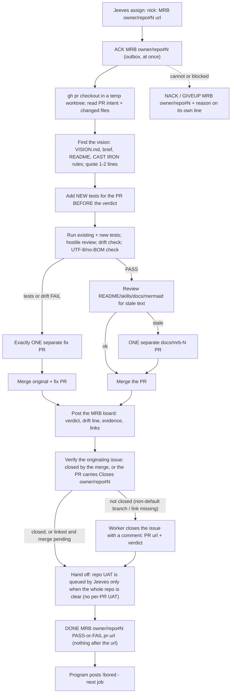

# bobiverse bob - MRB job (hostile review)

> **CAST IRON RULE - HARVEST AND FILE EVERYTHING (read this first, every time).**
> 1. ALWAYS harvest skills you learn and file EVERY issue / FR / bug / gap you find to the intake webhook in the
>    SAME turn. Never leave a finding unfiled, never "note it for later", never skip it because it is small.
> 2. File with the intake webhook (no secret or login needed; `POST https://irc.ntsa.uk/bob/v1/intake`; offline it is
>    queued locally and retried):
>    `.\scripts\Report-BobiverseIntakeIssue.ps1 -Repo SimonBarnett/bobiverse -Kind issue -Title "short title" -Body "what / where / evidence / fix"`
>    (`-Kind issue|fr|skill|harvest`; always pass an explicit `-Repo owner/name`).
> 3. BEFORE finishing ANY debugging session run the harvest step:
>    `.\scripts\Invoke-BobiverseHarvest.ps1 -Summary "what broke / what fixed it" -Lesson "one learned playbook line"`
>    then `.\scripts\Invoke-BobiverseHarvest.ps1 -Flush` to resend anything that was queued while offline.
> 4. Never put a token, password, SASL/NickServ secret, key or private hostname in a filing, a skill or a log.

**Job type `MRB`** (Material Review Board) - hostile, tests-first review of a pull request against the FR and the repo vision. Wire format and timing: `bobiverse-bob-job-irc`. The MRB is done by a **different seat or a fresh session** than the one that wrote the PR; the originating agent owns the review. An assigned MRB job authorises you to merge **that PR** (and its one docs/fix PR) - nothing else.

## Process

## Steps

1. **ACK.** 2. Check out the PR in a temp worktree; read the intent, the FR and every changed file. 3. **Vision first**: read `VISION.md`/brief/README/AGENTS and quote 1-2 lines the PR is judged against.
No vision found: record "no vision source found", review against README + FR, and file ONE FR asking for a `VISION.md`. If the PR shows the vision itself should change, do not edit it - file an FR tagged `vision` for the owner.
4. **Tests before verdict**: add the new tests the PR needs, then run existing + new. 5. Hostile review + **drift check** (separate verdict line): serves the stated vision? contradicts CAST IRON / earlier decisions? scope creep? under-delivery (letter, not intent; code never wired)? Drift is a FAIL like a red test.
6. Encoding: changed `*.md` are UTF-8 without BOM (no mojibake). 7. **PASS** -> review docs/skills/usage text for staleness; if stale open exactly ONE **separate** `docs/mrb-<N>-...` PR (never push onto the PR under review) and merge both; if not, merge the PR.
**FAIL** -> exactly ONE separate fix PR, then merge original + fix (not several fix PRs). Never merge UNSTABLE/red. 8. Post the MRB board. **Issue closure (t826u):** the assigned MRB authorises you to merge that PR (and its one docs/fix PR). On merge, the PR's **`Closes <owner>/<repo>#N`** line closes the originating issue - confirm that line is in the PR body (add it by editing the body if the FR author missed it; a fix/docs PR gets `Refs`, never a second `Closes`). If you are **not authorised to merge**, still confirm the `Closes` link so the issue closes when the owner merges, and say so on the board.
After the merge check `gh issue view N --repo <owner>/<repo> --json state`: if it is still open (PR merged into a non-default branch, or the link was missing) **close it yourself with a comment** (`gh issue close N --comment "Closed by <PR url> (merged into <branch>). MRB: <verdict>"`). A FAIL that ends without a merge leaves the issue open.
9. Hand off: there is no per-PR UAT - Jeeves queues ONE repo-level UAT once every issue is closed and every PR is merged. 10. **DONE** - only after the issue is verified closed, or (not merged yet) verified linked via `closingIssuesReferences`.

## Duplicates: verify and close them (t857u)

The PR body must carry a **`Duplicates closed:`** line (or `none (searched: ...)`). During the review search the open issues again for duplicates of what the PR fixes;
any still open that the implementer missed: comment **`Duplicate of #N / fixed by PR #M`** and close as not planned
(`gh issue close <dup> --repo <owner>/<repo> --reason "not planned" --comment "Duplicate of #N / fixed by PR #M"`), and add it to the board. A real extra issue the PR
fixes needs its own full-form `Closes <owner>/<repo>#D` line. A PR with no `Duplicates closed:` line is a review nit; a PR that leaves an obvious open duplicate is a FAIL
once the implementer cannot be reached. Never close `needs-human` / `board` issues as duplicates.

## Evidence required (the MRB board comment on the PR/issue)

* **Verdict** `PASS`/`FAIL`, plus the **drift verdict** line and the quoted vision line(s). * Tests: which new tests you added, the exact commands run, pass/fail counts, any flaky/skipped.
* Hostile findings (numbered, with file:line) and how each was resolved (or why it is acceptable). * Docs verdict (stale or not; link to the docs PR if any). * Merge result (SHAs/PR links), and **what could not be tested live**. * No secrets or private hosts.

## Who owns what

| Who | Owns |
|---|---|
| The originating agent | the hostile MRB and its verdict, the merge decision, then the UAT hand-off (`bobiverse-bob-job-uat`). |
| The implementer | the PR under review - they never review or merge their own PR; findings go back as the one fix PR (written by the MRB seat). |
| Jeeves | queue and busy/idle bookkeeping; announces merges. |
| The owner (Simon) | the vision; releases and version bumps (not part of an MRB). |

## Rules

* **A successful MRB closes the originating issue**: merge -> `Closes` auto-closes it; otherwise you close it with a comment (never leave a merged PR's issue open, never close it for a FAIL that did not merge). * Different seat/session than the author. One docs PR at most; one fix PR at most. No release, no version bump, no Ergo changes, no secrets, PowerShell only.
* Report which agent and model did the review. * CAST IRON harvest rule at the top: file every issue/FR/bug you find in the same turn - findings that are not part of this PR become new intake items.
