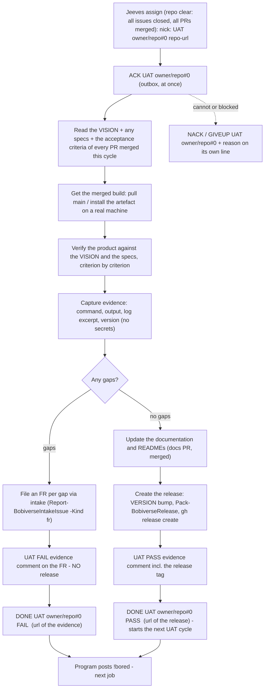

# bobiverse bob - UAT job (acceptance)

> **CAST IRON RULE - HARVEST AND FILE EVERYTHING (read this first, every time).**
> 1. ALWAYS harvest skills you learn and file EVERY issue / FR / bug / gap you find to the intake webhook in the
>    SAME turn. Never leave a finding unfiled, never "note it for later", never skip it because it is small.
> 2. File with the intake webhook (no secret or login needed; `POST https://irc.ntsa.uk/bob/v1/intake`; offline it is
>    queued locally and retried):
>    `.\scripts\Report-BobiverseIntakeIssue.ps1 -Repo SimonBarnett/bobiverse -Kind issue -Title "short title" -Body "what / where / evidence / fix"`
>    (`-Kind issue|fr|skill|harvest`; always pass an explicit `-Repo owner/name`).
> 3. BEFORE finishing ANY debugging session run the harvest step:
>    `.\scripts\Invoke-BobiverseHarvest.ps1 -Summary "what broke / what fixed it" -Lesson "one learned playbook line"`
>    then `.\scripts\Invoke-BobiverseHarvest.ps1 -Flush` to resend anything that was queued while offline.
> 4. Never put a token, password, SASL/NickServ secret, key or private hostname in a filing, a skill or a log.

**Job type `UAT`** - acceptance of a **whole repository** (t853u): UAT is per REPO, never per PR or per issue. Jeeves assigns it as `UAT owner/repo#0 https://github.com/owner/repo` and only after **every issue of the repo is closed** (excluding `needs-human`, boards/`mrb-home`, harvest/skill records) **and every PR is merged by MRB**; the row lists the PRs merged this cycle. Jeeves gives it to a seat that implemented **none** of those PRs whenever such a seat exists (if every live seat implemented something it may go to any seat - then say so in the evidence). Acceptance of the merged work of the cycle: The worker **verifies the product against the VISION** (bob product: `bob/VISION.md`; fleet umbrella: `common/docs/vision.md` / `docs\vision.md`; success table S1..Sn) **and any specs** (`docs\*spec*`, the FR acceptance criteria), with real evidence, then decides **by the gaps it found**: gaps -> an FR per gap and **no release**; no gaps -> update the documentation and READMEs and **create a release**. Wire format and timing are unchanged: `bobiverse-bob-job-irc` (ACK / DONE / NACK / GIVEUP in your own `#<machine>`). The **originating agent owns the UAT** (the requester of the FR, not the implementer); a UAT stamp, the docs update and the release happen only inside an assigned UAT job, by the worker - never by Jeeves / the chair.

## Visual UAT (design companion)

When the product under UAT has UI, screenshots, mocks, PDF pages, artboards, or other rendered artifacts, also run the absorbed design-UAT gates in [`design-uat.md`](design-uat.md) (ported from `SimonBarnett/bob-design-uat`):

* **G1** - spelling in image (OCR/read every visible word; typos are blockers).
* **G2** - layout and pixel deltas (measurable `delta_px` / `delta_hex`).
* **G3** - hallucination and invented chrome (`in_brief` vs `NOT_IN_BRIEF`).

Emit the required nit table. Workers do **not** stamp `ready for human UAT` or final `PASS-UAT`; Bob alone owns the human stamp. Fixture calibration and companion skills (`playwright-design`, `pdf-design`, `illustrator-design`, `graphics-design`, `uat-video-pack`) are documented in that companion.

## Process

## Steps

One issue per issue: when MRB (or any worker) finds a twin/duplicate issue, close the later one and comment a reference to the first; never leave both open; done issues are closed too.

1. **ACK.** 2. Confirm the repo really is clear: `gh issue list --repo owner/repo --state open` shows only excluded issues and `gh pr list --state open` is empty; each merged PR's originating issue must be **closed** (the PR's `Closes` / the MRB closed it; if an originating issue is still open on a successful path, close it with a comment linking the PR); the PRs merged this cycle are in the assign context (`merged_prs`) - if something is still open, `NACK` with that fact (Jeeves withdraws the row). Read the **VISION** (for bobiverse **bob** work: `bob/VISION.md` first — FR #1615 / harvest #1632; fleet umbrella remains `common/docs/vision.md` / `docs\vision.md`: objective, success table with how each metric is measured, fail-when) and every spec that applies, plus the FR's acceptance criteria and the MRB board. If there is no VISION/spec for the area, derive criteria from the FR text and say so in the evidence.
3. Test the **merged** result - not the branch - on a real machine/install, exactly as a user or operator would. 4. For each VISION success metric / spec requirement / FR criterion record: the action, the actual result, pass/fail. Include negative cases and the rollback/uninstall path if the change touches install or services.
5. **Decide on the gaps** (anything the product does not yet do or does wrongly against the VISION / specs / criteria):
   * **Gaps found -> NO release.** File **one FR per gap** through the intake (`.\scripts\Report-BobiverseIntakeIssue.ps1 -Repo owner/name -Kind fr -Title "<the gap>" -Body "vision/spec ref / expected / observed / evidence"`), post the evidence comment with the verdict line `UAT FAIL` and links to every new FR, keep the originating FR open, then `DONE UAT owner/repo#0 FAIL <url>`.
   * **No gaps -> update the docs and READMEs, then create the release.** (a) Bring the documentation and every affected README up to date with what you verified (behaviour, commands, versions) in a docs PR and merge it (that one PR only). (b) Create the release: bump `VERSION` to the next version in that PR/merge, build with `.\scripts\Pack-BobiverseRelease.ps1 -Product all`, publish with `gh release create <tag> <the msi assets> --repo owner/name --notes "<what changed + UAT evidence link>"`, and check `gh release view <tag>` lists every asset the VISION's S1 names. (c) Post the evidence comment with `UAT PASS` and the release tag, then `DONE UAT owner/repo#0 PASS <release url>`.
6. A failed docs merge, build or publish is **not** a PASS: file the problem as an issue through the intake, post what happened, and send `NACK UAT owner/repo#0` / `GIVEUP` with the reason (never leave a half-made release: delete a draft you created).

## Evidence required (the UAT comment)

* The version/commit/artefact you tested and the machine. * Per VISION metric / spec / criterion: steps, observed result, PASS/FAIL. * Raw proof: command lines and trimmed output, log excerpts with timestamps (no secrets, tokens, passwords, private hosts), screenshots only if text is not enough.
* What you could not test and why. * The final verdict line `UAT PASS` / `UAT FAIL`; on FAIL the links to every FR filed (one per gap); on PASS the docs PR and the release tag/url.

## Who owns what

| Who | Owns |
|---|---|
| The seat holding the repo UAT (never an implementer of the cycle's PRs while another seat exists) | the UAT of the whole repo: the verification against the VISION / specs, the evidence, the FR per gap, and - when there are no gaps - the docs/README update and the release. |
| The implementers and MRB seats | their PRs/reviews only - they never stamp UAT on their own work (the chair enforces it from the seat ledger). |
| Jeeves / the chair | queue bookkeeping (ACK busy, DONE idle); never verifies, files the gap FRs, updates docs or releases. |
| The owner (Simon) | the VISION and the specs; may veto / roll back a release. |

## Rules

* **UAT is per repo, never per PR / issue**; there is no UAT of a single PR. A seat that implemented a merged PR of the cycle does not run the repo UAT (unless the chair offered it because every live seat implemented something).
* Evidence before stamp; never stamp from the PR diff alone. * **Gaps => no release, ever**; a release exists only after a UAT with zero gaps. * One FR per gap, filed through the intake (explicit `-Repo`), never a bundle.
* No Ergo changes, PowerShell only, never print or commit secrets (no tokens in release notes, evidence or FRs). * The release is created only inside an assigned UAT job (the general "no release / no VERSION bump" rule is lifted for that case only).
* **FR #147:** never dump `nssm get <svc> AppEnvironmentExtra` values into the transcript — print env **key names only** (split on first `=`; see `bobiverse-fleet-ops`).
* CAST IRON harvest rule at the top: file every defect, gap and improvement you notice during UAT in the same turn.

## Harvested UAT gates (skill records #1216-#1429)

- `needs-mrb1` is a human-vision gate, not a machine pin: ACK then GIVEUP and wait for the label to be cleared. Do not start ionos/DEV1 work merely because the row was offered, and do not infer a machine from a title.
- Repo UAT is `UAT #0` only after the repository is clear. An exact-author escape may be used only when the remaining candidates are ledger/GIVEUP blocked; never UAT your own implementation or MRB-fix.
- A hard `require_machine`/seat pin beats `any` or an inferred default. Keep self-UAT and MRB-author rows away from their author; record the accepted-by/author stamps needed for later offers.
- After a UAT/MRB merge, resync main before re-offering and purge stale `offered_to`/`doing` state; a merged row must not be recycled as a fresh PR/UAT.
