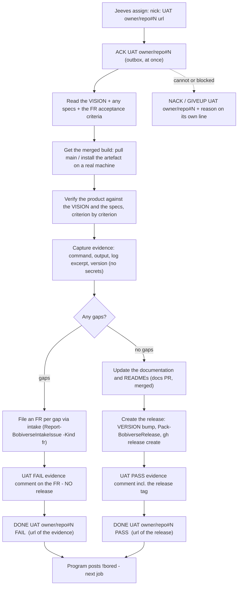

# bobiverse bob - UAT job (acceptance)

> **CAST IRON RULE - HARVEST AND FILE EVERYTHING (read this first, every time).**
> 1. ALWAYS harvest skills you learn and file EVERY issue / FR / bug / gap you find to the intake webhook in the
>    SAME turn. Never leave a finding unfiled, never "note it for later", never skip it because it is small.
> 2. File with the intake webhook (no secret or login needed; `POST https://irc.ntsa.uk/bob/v1/intake`; offline it is
>    queued locally and retried):
>    `.\scripts\Report-BobiverseIntakeIssue.ps1 -Repo SimonBarnett/bobiverse -Kind issue -Title "short title" -Body "what / where / evidence / fix"`
>    (`-Kind issue|fr|skill|harvest`; always pass an explicit `-Repo owner/name`).
> 3. BEFORE finishing ANY debugging session run the harvest step:
>    `.\scripts\Invoke-BobiverseHarvest.ps1 -Summary "what broke / what fixed it" -Lesson "one learned playbook line"`
>    then `.\scripts\Invoke-BobiverseHarvest.ps1 -Flush` to resend anything that was queued while offline.
> 4. Never put a token, password, SASL/NickServ secret, key or private hostname in a filing, a skill or a log.

**Job type `UAT`** - acceptance of a change that has passed MRB and is merged. The worker **verifies the product against the VISION** (`docs\vision.md`, its success table S1..Sn) **and any specs** (`docs\*spec*`, the FR acceptance criteria), with real evidence, then decides **by the gaps it found**: gaps -> an FR per gap and **no release**; no gaps -> update the documentation and READMEs and **create a release**. Wire format and timing are unchanged: `bobiverse-bob-job-irc` (ACK / DONE / NACK / GIVEUP in your own `#<machine>`). The **originating agent owns the UAT** (the requester of the FR, not the implementer); a UAT stamp, the docs update and the release happen only inside an assigned UAT job, by the worker - never by Jeeves / the chair.

## Process

## Steps

1. **ACK.** 2. Read the **VISION** (`docs\vision.md`: objective, success table with how each metric is measured, fail-when) and every spec that applies, plus the FR's acceptance criteria and the MRB board. If there is no VISION/spec for the area, derive criteria from the FR text and say so in the evidence.
3. Test the **merged** result - not the branch - on a real machine/install, exactly as a user or operator would. 4. For each VISION success metric / spec requirement / FR criterion record: the action, the actual result, pass/fail. Include negative cases and the rollback/uninstall path if the change touches install or services.
5. **Decide on the gaps** (anything the product does not yet do or does wrongly against the VISION / specs / criteria):
   * **Gaps found -> NO release.** File **one FR per gap** through the intake (`.\scripts\Report-BobiverseIntakeIssue.ps1 -Repo owner/name -Kind fr -Title "<the gap>" -Body "vision/spec ref / expected / observed / evidence"`), post the evidence comment with the verdict line `UAT FAIL` and links to every new FR, keep the originating FR open, then `DONE UAT owner/repo#N FAIL <url>`.
   * **No gaps -> update the docs and READMEs, then create the release.** (a) Bring the documentation and every affected README up to date with what you verified (behaviour, commands, versions) in a docs PR and merge it (that one PR only). (b) Create the release: bump `VERSION` to the next version in that PR/merge, build with `.\scripts\Pack-BobiverseRelease.ps1 -Product all`, publish with `gh release create <tag> <the msi assets> --repo owner/name --notes "<what changed + UAT evidence link>"`, and check `gh release view <tag>` lists every asset the VISION's S1 names. (c) Post the evidence comment with `UAT PASS` and the release tag, then `DONE UAT owner/repo#N PASS <release url>`.
6. A failed docs merge, build or publish is **not** a PASS: file the problem as an issue through the intake, post what happened, and send `NACK UAT owner/repo#N` / `GIVEUP` with the reason (never leave a half-made release: delete a draft you created).

## Evidence required (the UAT comment)

* The version/commit/artefact you tested and the machine. * Per VISION metric / spec / criterion: steps, observed result, PASS/FAIL. * Raw proof: command lines and trimmed output, log excerpts with timestamps (no secrets, tokens, passwords, private hosts), screenshots only if text is not enough.
* What you could not test and why. * The final verdict line `UAT PASS` / `UAT FAIL`; on FAIL the links to every FR filed (one per gap); on PASS the docs PR and the release tag/url.

## Who owns what

| Who | Owns |
|---|---|
| The originating agent (the worker running the UAT job) | the UAT: the verification against the VISION / specs, the evidence, the FR per gap, and - when there are no gaps - the docs/README update and the release. |
| The implementer and the MRB seat | their PR/review only - they never stamp UAT on their own work. |
| Jeeves / the chair | queue bookkeeping (ACK busy, DONE idle); never verifies, files the gap FRs, updates docs or releases. |
| The owner (Simon) | the VISION and the specs; may veto / roll back a release. |

## Rules

* Evidence before stamp; never stamp from the PR diff alone. * **Gaps => no release, ever**; a release exists only after a UAT with zero gaps. * One FR per gap, filed through the intake (explicit `-Repo`), never a bundle.
* No Ergo changes, PowerShell only, never print or commit secrets (no tokens in release notes, evidence or FRs). * The release is created only inside an assigned UAT job (the general "no release / no VERSION bump" rule is lifted for that case only).
* **FR #147:** never dump `nssm get <svc> AppEnvironmentExtra` values into the transcript — print env **key names only** (split on first `=`; see `bobiverse-fleet-ops`).
* CAST IRON harvest rule at the top: file every defect, gap and improvement you notice during UAT in the same turn.
