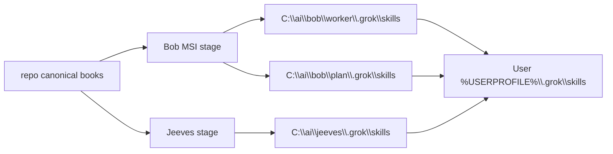
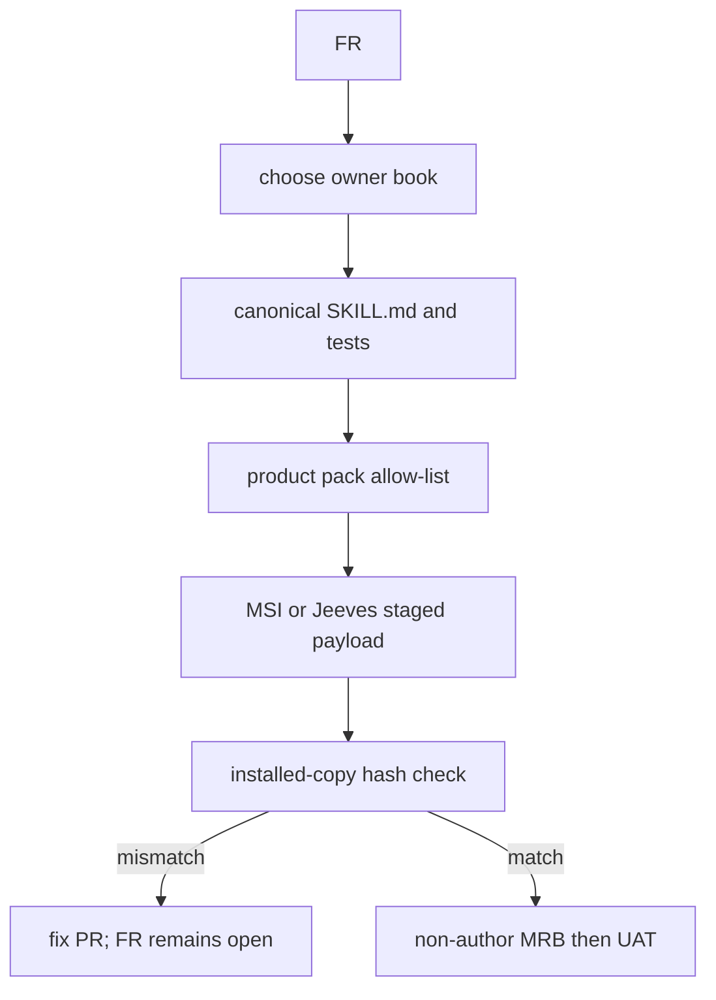
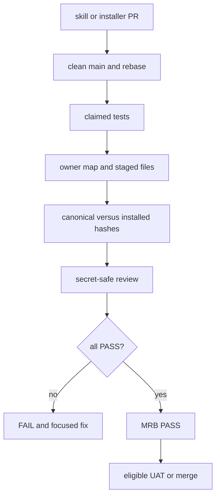
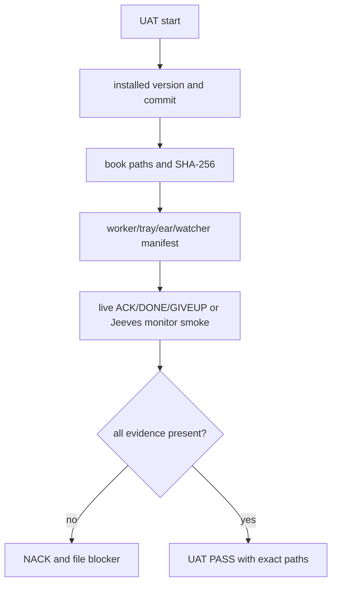

# Skill-book and vending audit — 2026-10-04

## Result

The harvest commit `b15182a` was submitted as PR #1491 and merged. Its lessons are already promoted into the existing owner books. This audit keeps the remaining cross-cutting placement and install evidence with the shared `bobiverse-fleet-ops` book, which is staged by both the Bob MSI and the Jeeves install.

External DBA lessons live in `SimonBarnett/skill-dba`, pinned here as `bobiverse-fleet-ops/skill-dba/UPSTREAM-PIN.txt` (ref recorded in-tree). Do not invent a second top-level `skills` tree or a free-floating `skill-dba` book at the bobiverse root; keep the pin under the shared fleet-ops book and file product lessons to an owning book with source issue/PR before deeper vendoring.

## Owner map

| Evidence or lesson | Canonical owner | Product projection |
|---|---|---|
| Bob worker, outbox/dead writer, seat JOIN, worker exe | `bob/.grok/skills/bobiverse-bob-worker/SKILL.md` | Bob MSI; `C:\\ai\\bob\\worker\\.grok\\skills`; user `.grok\\skills` |
| FR intake, `Closes #N`, no false closure | `bob/.grok/skills/bobiverse-bob-job-fr/SKILL.md` | Bob MSI worker/agent layer |
| hostile MRB, non-author review, staged payload | `bob/.grok/skills/bobiverse-bob-job-mrb/SKILL.md` | Bob MSI worker/agent layer |
| UAT, live ACK/DONE/GIVEUP, machine pins | `bob/.grok/skills/bobiverse-bob-job-uat/SKILL.md` | Bob MSI worker/agent layer |
| tray/ear/watcher executable notes and install hashes | Bob worker + this shared audit | Bob MSI payload and worker book |
| queue/resync, chair/digest home, monitor smoke | `jeeves/.grok/skills/bobiverse-jeeves-monitor/SKILL.md` | Jeeves install; user `.grok\\skills` |
| machine pins, secret-safe service/task recovery | this shared `bobiverse-fleet-ops` book | Bob MSI + Jeeves install |
| harvest/intake and deduplication | `common/.grok/skills/harvest-agent-skills/SKILL.md` | Bob MSI + Jeeves install |

User-level extras from retired `agentic_*` worktrees (`agent-monitor`, `watch-seat`, old `agentic-*`, etc.) are legacy copies, not new product books. They remain untouched; only canonical books are refreshed by installers.

## Vending topology

The pack copies the complete shared `bobiverse-fleet-ops` directory, not just its `SKILL.md`; the installer then replaces the matching user-level book from the staged directory. Compare relative paths and SHA-256 after installation. Never hand-edit only an installed copy.

## FR acceptance flow

The merged PR must contain `Closes #N`; a harvest record or static file listing alone does not close an FR.

## MRB acceptance flow

The implementing seat cannot self-MRB. A green unit test without staged-payload and installed-copy evidence is not PASS. A live-seat limitation remains a blocker rather than being inferred away.

## UAT acceptance flow

A service state, scheduled-task listing, or PyInstaller string search is not live worker UAT. Record Access Denied or missing elevation explicitly.

## Audit checklist

1. Source checkout is clean `main` and fast-forwarded.
2. Bob worker/plan and Jeeves `.grok\\skills` match their allow-lists and canonical hashes.
3. Pack tests pass and MSI harvest includes the shared book plus its audit sidecar.
4. Installed user-level copies are compared by SHA-256; legacy extras are reported, not silently deleted.
5. Report MSI version, source commit, target folders, and FR/MRB/UAT evidence without secrets.
