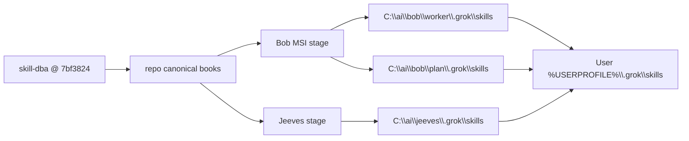
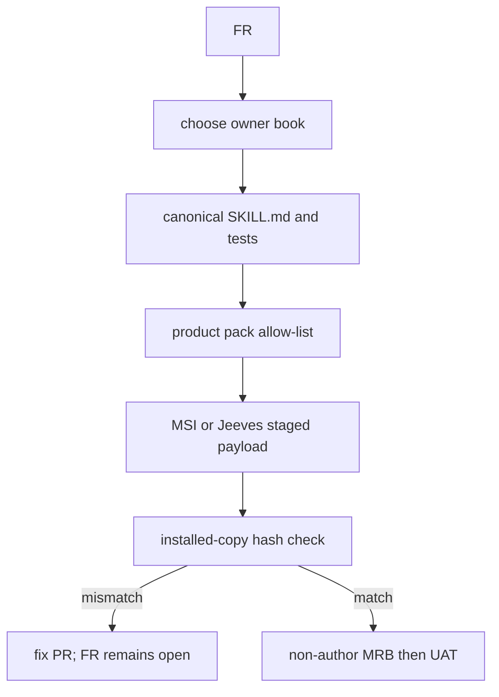
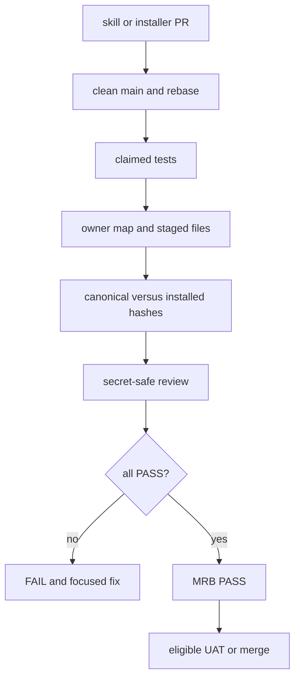
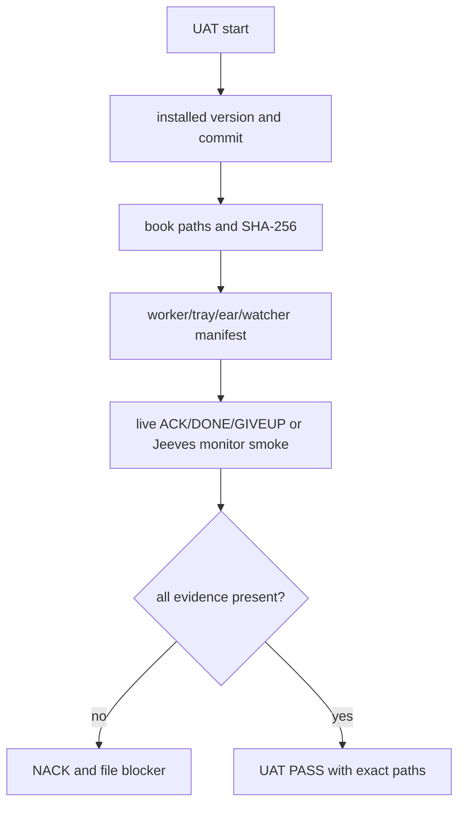

# Skill-book and vending audit — 2026-10-04

## Result

The harvest commit `b15182a` was submitted as PR #1491 and merged. Its lessons are already promoted into the existing owner books. This audit keeps cross-cutting placement and install evidence with the shared `bobiverse-fleet-ops` book, staged by both the Bob MSI and the Jeeves install.

The MSSQL DBA source is `SimonBarnett/skill-dba` at pinned main commit `7bf3824ae5b6de3cf461bd22118658c4e371d5b4`. Its twelve `.grok/skills/<name>/SKILL.md` books, config example, scripts, and docs are vendored under `skill-dba/` in this shared book. Future DBA harvests must arrive on skill-dba as a branch + PR; never silently edit the vendor or push main.

## Owner map

| Evidence or lesson | Canonical owner | Product projection |
|---|---|---|
| Bob worker, outbox/dead writer, seat JOIN, worker exe | `bob/.grok/skills/bobiverse-bob-worker/SKILL.md` | Bob MSI; `C:\\ai\\bob\\worker\\.grok\\skills`; user `.grok\\skills` |
| FR intake, `Closes #N`, no false closure | `bob/.grok/skills/bobiverse-bob-job-fr/SKILL.md` | Bob MSI worker/agent layer |
| hostile MRB, non-author review, staged payload | `bob/.grok/skills/bobiverse-bob-job-mrb/SKILL.md` | Bob MSI worker/agent layer |
| UAT, live ACK/DONE/GIVEUP, machine pins | `bob/.grok/skills/bobiverse-bob-job-uat/SKILL.md` | Bob MSI worker/agent layer |
| tray/ear/watcher executable notes and install hashes | Bob worker + this shared audit | Bob MSI payload and worker book |
| queue/resync, chair/digest home, monitor smoke | `jeeves/.grok/skills/bobiverse-jeeves-monitor/SKILL.md` | Jeeves install; user `.grok\\skills` |
| machine pins, secret-safe service/task recovery | this shared `bobiverse-fleet-ops` book | Bob MSI + Jeeves install |
| harvest/intake and deduplication | `common/.grok/skills/harvest-agent-skills/SKILL.md` | Bob MSI + Jeeves install |
| MSSQL backup/health/cutover and DBA harvest | vendored `skill-dba/.grok/skills/*` | Bob MSI + Jeeves shared fleet book |

User-level extras from retired `agentic_*` worktrees (`agent-monitor`, `watch-seat`, old `agentic-*`, etc.) are legacy copies, not new product books. They remain untouched; only canonical books are refreshed by installers.

## Vending topology

The pack copies the complete shared `bobiverse-fleet-ops` directory, not just its `SKILL.md`; the installer then replaces the matching user-level book recursively. Compare relative paths and SHA-256 after installation. Never hand-edit only an installed copy.

## FR acceptance flow

## MRB acceptance flow

## UAT acceptance flow

A service state, scheduled-task listing, or PyInstaller string search is not live worker UAT. Record Access Denied or missing elevation explicitly.

## Audit checklist

1. Source checkout is clean `main` and fast-forwarded.
2. Bob worker/plan and Jeeves `.grok\\skills` match allow-lists and canonical hashes.
3. Pack tests pass and MSI harvest includes the shared book plus its audit sidecar and `skill-dba/` subtree.
4. Installed user-level copies are compared by SHA-256; legacy extras are reported, not silently deleted.
5. Report MSI version, source commit, target folders, and FR/MRB/UAT evidence without secrets.
