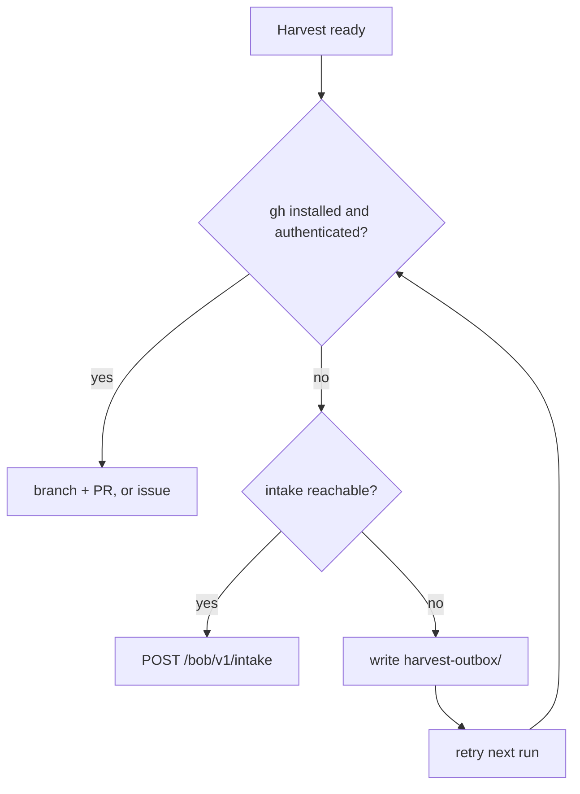

# Harvest (honesty box) — bobiverse

> **CAST IRON RULE - HARVEST AND FILE EVERYTHING (read this first, every time).**
> 1. ALWAYS harvest skills you learn and file EVERY issue / FR / bug / gap you find to the intake webhook in the
>    SAME turn. Never leave a finding unfiled, never "note it for later", never skip it because it is small.
> 2. File with the intake webhook (no secret or login needed; `POST https://irc.ntsa.uk/bob/v1/intake`; offline it is
>    queued locally and retried):
>    `.\scripts\Report-BobiverseIntakeIssue.ps1 -Repo SimonBarnett/bobiverse -Kind issue -Title "short title" -Body "what / where / evidence / fix"`
>    (`-Kind issue|fr|skill|harvest`; always pass an explicit `-Repo owner/name`).
>    Worker status receipts (DONE/NACK/GIVEUP/SKIP/self-MRB/twin/duplicate/merged or FR/MRB/UAT `#N`) are not issue/FR findings: use `Invoke-BobiverseHarvest.ps1`/`kind: harvest`, and never file the `harvest:` receipt itself as a GitHub issue.
> 3. BEFORE finishing ANY debugging session run the harvest step:
>    `.\scripts\Invoke-BobiverseHarvest.ps1 -Summary "what broke / what fixed it" -Lesson "one learned playbook line"`
>    then `.\scripts\Invoke-BobiverseHarvest.ps1 -Flush` to resend anything that was queued while offline.
> 4. Never put a token, password, SASL/NickServ secret, key or private hostname in a filing, a skill or a log.

**Harvest repo (a-search incident 2026-10-08):** always pass the job's repo: `Invoke-BobiverseHarvest.ps1 -Repo <owner/repo of the job> -Summary ... -Lesson ...` (job `FR SimonBarnett/a-search#N` -> `-Repo SimonBarnett/a-search`, which lands in a-search `.grok/skills/harvest-agent-skills/SKILL.md`). Never harvest a-search or other product lessons to SimonBarnett/bobiverse; only Bob fleet tooling lessons use `-Repo SimonBarnett/bobiverse`.


## Cost of use (CAST IRON)

Skill-intake consolidation: when a worker takes an FR from skill intake (label:skill / harvest), it must close all open issues for that skill book (every harvest/skill issue targeting the same book), open one consolidated PR for them, and cite every issue it closes (Closes #N for each); no per-issue PRs for the same skill book; the worker closes the issues itself as part of DONE.

One issue per issue: when MRB (or any worker) finds a twin/duplicate issue, close the later one and comment a reference to the first; never leave both open; done issues are closed too.

Using any skill from this book obliges you to report back here, in the same
turn you learn or fix something. Do not ask permission. Do not defer.

- Gap, bug or wish → issue (`FR:` for features). When the operator has no
  GitHub account, POST `kind: issue` | `fr` to `/bob/v1/intake`.
- New or fixed playbook → branch + PR (never `main`).
- Empty harvest only when nothing is new and nothing is broken.

**Home:** `https://github.com/SimonBarnett/bobiverse`. Frontmatter `github:`
MUST stay on this repo.

`harvest-agent-skills` remains as the bobiverse harvest index / where-to-put
lessons table; **this** `harvest` skill is the honesty-box report route
(including intake). Prefer this name for report/intake; keep both installed.

## What to harvest here

- bob / airc / jeeves MSI install, NSSM, secrets, tray/TipForm, digest webhook,
  chair/Jeeves webhooks (`bobcallback`), IRC SASL/NickServ, and post-install
  lessons for this fleet.
- Skill harvests land under `.grok/skills/bobiverse-bob|airc|jeeves`,
  `docs/post-install.md`, and `docs/skill-harvest-log.md`.

Do **not** harvest Day Works product, CE Priority DBA, or generic formprep
lessons here — route those to their owning repos.

## Report route (strict order)

Never require anyone to create a GitHub account just to report back.



*Caption: prefer `gh`; fall back to the Bob webhook intake; if offline, queue locally and retry.*

1. **`gh` available and authenticated** → branch + PR against
   `SimonBarnett/bobiverse` (skills) or an issue (`harvest:` / `FR:`). If the PR
   cannot be opened, file a `harvest:` issue with the intended PR title, branch,
   file list and body in this turn.
2. **No `gh`, or not authenticated** → POST to the Bob webhook intake
   `https://irc.ntsa.uk/bob/v1/intake`. No GitHub account needed; the
   service files it with label `via-intake`. Send an `idempotency_key` so
   retries never duplicate. Missing/empty `kind` defaults to `issue`.
3. **Offline / intake unreachable** → write the JSON payload to a local
   `harvest-outbox/` (or `report-outbox/` / `install-outbox/`) folder and retry
   it (same `idempotency_key`) on the next run. Helper:
   `scripts/Report-BobiverseIntakeIssue.ps1`.

### Open skill / harvest receipts → consolidate then PR (FR #1682 / FR #1684)

Intake `kind: skill|harvest` creates `label:skill` issues. The chair **offers** them as FR promote jobs (not product code FRs; they still do not block repo UAT). Do **not** GIVEUP. Without a promote PR the lessons never reach MRB merge.

When you have `gh` write (same turn or on a skill-promote assign):

1. Group open `label:skill` issues **by owner skill book** (see `harvest-agent-skills` table).
2. **Close duplicate** receipts for the same book/lesson.
3. Open **one** `harvest/…` PR per book (or one multi-book PR with clear paths) that promotes unique Lesson lines; PR body uses `Closes …` / `Duplicates closed: …`.
4. Leave merge to hostile **MRB**. Never push `main`.

Full steps: skill `harvest-agent-skills` section **Worker: consolidate open skill receipts → promote PR**.

### Intake must link an existing harvest PR (FR #1812 / harvest #2013)

When intake `kind: skill|harvest` (or a harvest summary) already names a GitHub **pull** URL in the title/body, the intake host must **`linked_existing_pr`** — comment on / attach that PR — and must **not** open a second fallback `label:skill` issue. Log `draft_pr_error` when draft-PR creation fails. `Invoke-BobiverseHarvest` / `issue_skip_fr_reason` should treat via-intake+skill "PR opened" receipts as `harvest_pr_summary` (skip re-offer as product FR). Product code: PR #2012.

Payload fields: `kind` (`issue` | `fr` | `skill` | `harvest`), **`repo`
(required `owner/name` — never omit; no default)**, `title`, `body`, optional
`files[]` (`path` + `content`, small), `source` (machine, agent/tool, skill
book + version), optional `contact`, `idempotency_key`. **No auth required** —
any skill user may POST. Optional fleet intake key `X-Bob-Intake-Key` /
`BOB_INTAKE_KEY` only when the host enables keyed mode; do not invent a secret
requirement. Never commit secrets.

curl:

```bash
curl -sS -X POST "https://irc.ntsa.uk/bob/v1/intake" \
  -H "Content-Type: application/json" \
  -d @harvest.json
```

PowerShell:

```powershell
.\scripts\Report-BobiverseIntakeIssue.ps1 -Repo SimonBarnett/bobiverse -Kind harvest -Title 'harvest: ...' -Body '...'
# close a session (summary + lessons, secret-scanned, queued offline):
.\scripts\Invoke-BobiverseHarvest.ps1 -Summary '...' -Lesson '...' [-SkillFile path]
.\scripts\Invoke-BobiverseHarvest.ps1 -Flush
# FR #2237: skip Invoke-BobiverseHarvest when the ONLY lesson is a twin/already-fixed
# DONE playbook (Duplicate of #N + DONE citing covering PR). Filing those creates nested
# skill twins that the chair re-offers as FR. Real new playbooks still harvest normally.
# FR #2970: also skip FAIL-supersede / wrong-book Harvest-lesson *process* playbooks
# (belong in bobiverse-bob-job-mrb). Intake returns lesson_already_covered when harvest +
# job-mrb already carry that CAST IRON routing — never open another lesson(harvest) twin.
# FR #2991: FAIL-supersede + thin already-covered / close-thin-twin restatements (no job-mrb
# process cue) also skip — tip #2990 class after #2988.
# FR #3004: default -Book harvest yields to keyword-inferred product books (bob-worker /
# fleet-ops / job-mrb); if the owning skill already has the lesson, intake returns
# lesson_already_covered — never open lesson(harvest) twins like #3001-#3003 after #2997.
# MRB #2973: bare "FAIL-supersede" in a summary alone is not enough to re-route; a process
# cue is required so real product lessons still open under harvest.
# or:
Invoke-RestMethod -Method Post -Uri 'https://irc.ntsa.uk/bob/v1/intake' `
  -ContentType 'application/json' -Body (Get-Content harvest.json -Raw)
```

Expect `202 {intake_id, url}` or `202 {intake_id, queued:true}`. Check status
with `GET /bob/v1/intake/<id>`.

`-Flush` (FR #139 / FR #3135) inspects `payload.repo` via `Test-IntakeRepoAllowed`
(mirrors `intake.repo_allowed`): any `SimonBarnett/<name>` matching the intake
repo regex is allowed; non-SimonBarnett owners stay denied unless listed in
`DEFAULT_ALLOW_REPOS` (optional extra / docs examples). Outside that rule, or
HTTP 403 `repo_not_allowed`, payloads are **DROPPED** into
`report-outbox/dropped/` (or the matching outbox `dropped/`) so Flush stays
clean. Transient errors stay KEPT for retry. New Plan products under
`SimonBarnett/*` need **no** per-repo allowlist edit — after an allow-*rule*
change merges, **ionos** must Sync/compose ircJeeves so live intake picks it up
(FR #3117 / #3122). Queue suppress/prioritise with `!ignore` / `!focus`.

Prefer `gh` and repo scripts over free-form reasoning.

## Report a bug or feature request

| `kind` | Meaning | Labels from intake |
|--------|---------|--------------------|
| `issue` | Bug / gap | `via-intake` (do **not** stamp `needs-mrb1` — offer hallucination) |
| `fr` | Feature request | `via-intake`, `feature-request` (do **not** stamp `needs-mrb1`) |
| `skill` / `harvest` | Skill harvest files | `via-intake`, `skill` |

**CAST IRON (FR #1526 / harvest #1717):** never create, stamp, or apply GitHub label `needs-mrb1` / `mrb1`. That label was an offer hallucination. The real human gate is `needs-human`. Leftover repo labels are inert for offers (`gated_counts.needs-mrb1=0`, `row_awaits_mrb1` always false). Intake must omit `needs-mrb1`.

### Living product FR when intake vanishes into harvest-only (harvest #2001)

`Invoke-BobiverseHarvest` / intake `kind: skill|harvest` creates **receipts** (`label:skill`). They are not the product work item. If a real product plan/FR was meant to live on the board but only harvest receipts exist (or the product FR was closed/superseded into harvest noise):

1. Create a **canonical living FR** with `gh issue create -R owner/repo --label feature-request` (and `via-intake` only if still filing via intake `kind: fr`).
2. Treat **that** issue number as the living FR - append WP evidence / comments there.
3. Point harvest receipts at it with `Refs #N` / close as superseded operational report; do not implement the product plan on a `label:skill` harvest issue.

Example: jeeves.exe chair+HTTP one-process plan lives at #1993, not on harvest receipts.

Default `repo` for this book: `SimonBarnett/bobiverse`.

**FR #3189 (job-repo routing):** when the seat's offered job is a product repo (e.g. `SimonBarnett/a-search`),
`Invoke-BobiverseHarvest` uses `-JobRepo` / `$env:BOB_JOB_REPO` / `run\job-repo.txt` so the harvest lands in **that**
repo (a-search default book `harvest-agent-skills` at `.grok/skills/harvest-agent-skills/SKILL.md`). Do **not** park
a-search product tips under bobiverse `harvest/SKILL.md`. Bob tooling (bob-worker, fleet-ops, jeeves, tray) still
routes to bobiverse via the split rule.

## Do not

- Push harvest to `main`, or commit "nothing found".
- Put secrets, tokens, keys, or personal paths in skills; use placeholders.
- End a turn with a new/fixed skill only in chat or a local folder without a
  PR, issue, intake receipt or `harvest-outbox/` entry.
- Add a separate `/bob/v1/harvest` endpoint — harvest is intake with the
  appropriate `kind`.

## Harvested lessons (intake)

- When Clear-BobiverseJobWorktrees removes 0 under low disk: file intake or GIVEUP / use a roomy drive - never hand-delete wt-bob-main/wt-airc/operator trees; write .bobiverse-seat so -Force skips live owners
- GET /bob/v1/report must never call GitHub pr_exists while holding gitclaim queue lock; snapshot under lock, check outside, re-lock with cached verdicts + single-flight + short lock_timeout
- Harvest-lesson MRB playbooks (fold duplicates into behind-main #1647; never leave a fake extra numbered review step) belong in `bobiverse-bob-job-mrb`. If intake files them under `harvest`, MRB moves/folds them there - do not land a second copy in this book (MRB #2740 / #2749).
- When a whole-file SKILL.md overwrite drops rules, restore from git show reverse of the wipe commit; widen Measure-BobTrayWorkerSeats pin windows when comments grow; drop nested skill-dba\.grok from Sync-BobiverseAgentFolders staging.
- On Windows Node 22, npm test should use node --test "tests/**/*.test.js"; a bare tests directory arg can fail MODULE_NOT_FOUND
- MRB airc ACL: Protect FailClosed + forced NoStart before Start-Service; Ensure ProgramData before manifest/log; purge allow-list refuses canaries; WiX lay-time ACL may stay residual ACCEPTABLE drift; put additive hostile pins on docs/mrb-N after product merge

## Harvest digest (lessons audit 2026-10-06)

Generalised from 81 harvested lessons that never reached this book (audit for FR #2705). The per-lesson table is in `common/docs/harvest-lessons-audit-2026-10-06.md`.

- **Legacy harvest-as-FR twins (before FR #2705):** when a closed or duplicate harvest/skill receipt is offered as work, ACK, confirm the lesson is already on main or in an open promote/lesson PR, DONE with that covering PR URL, and close the receipt as `Duplicate of #N / fixed by PR #M`. Never open a second promote PR and never re-harvest the twin playbook itself. Since FR #2705, lessons land as `lesson(<book>)` PRs, so these receipts should no longer reach seats. (71 lessons: harvest #2275, #2242, #2239, #2235, #2232, #2229 +95 more, 5 held intake rows)
- **Skill and harvest rows offered as FR:** a promote assign means consolidating by book into one skills PR with `Closes` (never GIVEUP or SKIP_FR it). A harvest-of-harvest or receipt-only row is not work: ACK, then DONE or GIVEUP citing the covering PR. Invoke-BobiverseHarvest skips GIVEUP-of-skill, twin-DONE-only, FAIL-supersede process-routing, and thin already-covered FAIL-supersede twin loops (FR #936 / #2237 / #2970 / #2991); default `-Book harvest` yields to the owning product book and intake returns `lesson_already_covered` when that skill already has the bullet (FR #3004); intake skips or re-routes those lessons so they never open a second `lesson(harvest)` tip. (8 lessons: harvest #1835, #1698, #1530, #927, #948, #937 +1 more, 1 held intake row)
- **Intake and Flush:** WinPS clients POST UTF-8 bytes and read optional response properties through PSObject.Properties. Permanent 400s are dropped, not retried. Intake 502.3 on irc.ntsa.uk means the chair listener is down (an ionos-only heal): queue offline and Flush later. FR #3135 allows any `SimonBarnett/*`; use `!ignore` / `!focus` for queue behaviour (archived SimonBarnett repos are intake-allowed again under the owner gate). Drain held outboxes with `drain --dry-run` first. Receipts never drop Lessons (FR #2705). (2 lessons: harvest #919, #904, #721; FR #3135)
